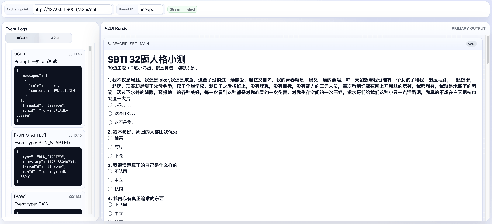
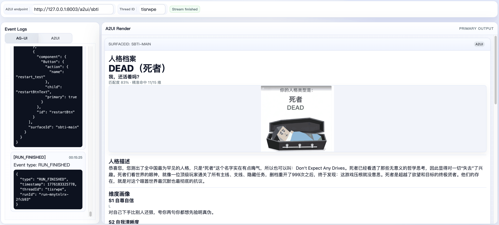

# A2UI SBTI Example

This example recreates the `sbti.ai` style personality test with `a2ui` and a `graphagent` workflow, while keeping the quiz flow deterministic instead of random.

## What it demonstrates

- A graph-orchestrated A2UI flow that uses only agent nodes in the graph.
- A `sbti_director` llm agent node that owns quiz state reconstruction, official-score calculation, result matching, and minimal state generation.
- A `sbti_a2ui_renderer` llm agent node that only converts the director state into final A2UI output.
- The official `sbti.ai` question content and official scoring logic, but with deterministic ordering instead of the site's random shuffle.
- The result page keeps the official type-page essentials: image, type title, short tagline, one description block, and the 15-dimension portrait list.
- A standard A2UI quiz interaction model where `MultipleChoice` updates local bound state immediately, while only `submit_test` and `restart_test` trigger new agent requests.
- `GraphTerminalMessagesOnly` is enabled at the AG-UI runner boundary so only the renderer node output is exposed to the A2UI stream.

## Architecture

```text
user prompt / userAction
        |
        v
   sbti_director (output schema)
        |
        v
 sbti_a2ui_renderer (planner/a2ui)
```

The graph contains only two agent nodes and does not depend on `WithSubgraphIsolatedMessages(true)`, `WithSubgraphInputFromLastResponse()`, function tools, or custom graph nodes.
All business rules live in static instruction assets, the director emits one structured JSON object under a static output schema, and the renderer consumes that JSON through one shared renderer instruction asset. The local repo runtime rewrites the platform placeholder to the internal output-key placeholder before invoking the renderer.
The quiz is rendered as one deterministic long form: `q1` through `q30`, then `drink_gate_q1`, then `drink_gate_q2` on the same page. All 32 questions stay visible and are submitted together.

## Screenshots

Quiz page:



Result page:



## Logic Alignment

The example intentionally follows `sbti.ai` on content and scoring while diverging on ordering only:

- Fixed official main question bank instead of LLM-generated questions.
- Fixed question order instead of random shuffle.
- `drink_gate_q1` always appears after `q30`.
- `drink_gate_q2` also always appears in the fixed long form.
- Two questions per scored dimension across `15` dimensions.
- Dimension scores converted to `L / M / H` levels with the official thresholds.
- Final type selected by nearest-pattern matching.
- `drink_gate_q1 == 3` and `drink_gate_q2 == 2` together override the normal match with `DRUNK`.
- Rare combinations still fall back to `HHHH`.

## Low-Code Mapping

If your platform only exposes agent-node level configuration, this example maps directly to two agents:

- `sbti_director`: configure it with a static instruction file and static output schema file.
- `sbti_a2ui_renderer`: configure it with `planner/a2ui` plus the shared static renderer instruction file. The file expects `{{input.output_text}}`, and the local repo runtime rewrites that placeholder internally.

In platform terms, the split is:

- `director.model`: use the logic model that handles state reconstruction and score matching. Local runtime defaults to `gpt-5.2`.
- `director.instruction`: `assets/director_instruction.txt`.
- `director.output schema`: `assets/director_output_schema.json`.
- `director.tool`: none are required.
- `director.skill`: optional, if you want to package the rulebook externally.
- `renderer.model`: use the rendering-quality model. Local runtime defaults to `gpt-5.2`.
- `renderer.instruction`: `assets/renderer_instruction.txt`. This shared file expects the previous director output to be injected through `{{input.output_text}}`. The local repo runtime rewrites that placeholder to its internal output-key placeholder automatically.
- `renderer.planner`: use `a2ui` in the local repo runtime.
- `renderer.state input`: inject the previous director output JSON into `{{input.output_text}}` when the platform runs the renderer node.
- `renderer.planner fallback`: if your platform does not support `planner/a2ui`, you need to provide an equivalent A2UI planner instruction from your own platform integration. This example no longer ships a separate fallback planner asset.
- `renderer.output schema`: none are required.
- `renderer.tool`: none are required.

## Run the server

From repository root:

```bash
export OPENAI_API_KEY="your-api-key"
export OPENAI_BASE_URL="https://api.openai.com/v1" # Optional for OpenAI-compatible gateways.

cd examples/a2ui/server/sbti
go run .
```

Optional flags:

- `-renderer-model`: model used by the renderer agent. Default: `gpt-5.2`.
- `-director-model`: model used by the director agent. Default: `gpt-5.2`.
- `-stream`: whether streaming is enabled. Default: `true`.
- `-address`: listen address. Default: `127.0.0.1:8080`.
- `-path`: AG-UI/A2UI path. Default: `/a2ui/sbti`.

Default endpoint:

```text
http://127.0.0.1:8080/a2ui/sbti
```

## Use the existing client

In a second terminal:

```bash
cd examples/a2ui/client
python3 -m http.server 4173
```

Open:

```text
http://127.0.0.1:4173
```

Set the endpoint to:

```text
http://127.0.0.1:8080/a2ui/sbti
```

Suggested opening prompt:

```text
帮我开始 SBTI 人格测试。
```

Then answer the rendered multiple-choice inputs on the long questionnaire. Local selections stay inside the bound quiz data model, and `submit_test` sends one nested `questions` object plus one nested `special` object for scoring. The questionnaire itself does not submit on every selection change.

## Related docs

- Server example index: [examples/a2ui/server/README.md](../README.md)
- Top-level example: [examples/a2ui/README.md](../../README.md)
- Frontend client: [examples/a2ui/client/README.md](../../client/README.md)
