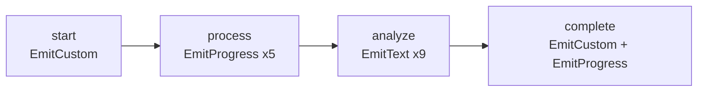

# EventEmitter Server Example

This example demonstrates how to use `EventEmitter` to emit custom events from NodeFunc during graph execution.

## Features Demonstrated

| Node | Feature | EventEmitter Method |
|------|---------|-------------------|
| `start` | Custom events with payload | `EmitCustom("workflow.started", {...})` |
| `process` | Progress events (simulated 5-step operation) | `EmitProgress(progress, message)` |
| `analyze` | Streaming text events | `EmitText(text)` |
| `complete` | Final completion event | `EmitCustom("workflow.completed", {...})` |

## Running the Server

```bash
cd examples/agui
go run ./server/event_emitter
```

### Options

| Flag | Default | Description |
|------|---------|-------------|
| `-address` | `127.0.0.1:8080` | Listen address |
| `-path` | `/agui` | HTTP path |

### Example

```bash
go run ./server/event_emitter -address 0.0.0.0:9090 -path /events
```

## Testing with the Client

In another terminal, run the client:

```bash
cd examples/agui
go run ./client/event_emitter
```

## Server Output

When running, you'll see server-side logs:

```
INFO    🚀 Starting AG-UI server with EventEmitter demo at http://127.0.0.1:8080/agui
INFO    📝 This example demonstrates:
INFO       - Custom events with payload (workflow.started, workflow.completed)
INFO       - Progress events (node.progress)
INFO       - Streaming text events (node.text)
INFO    💡 Run the client example to test:
INFO       go run ./client/event_emitter
```

When a request comes in:

```
INFO    [startNode] Starting workflow...
INFO    [startNode] Emitted 'workflow.started' custom event
INFO    [processNode] Processing data with progress reporting...
INFO    [processNode] Emitted progress: 20% - Step 1/5
INFO    [processNode] Emitted progress: 40% - Step 2/5
INFO    [processNode] Emitted progress: 60% - Step 3/5
INFO    [processNode] Emitted progress: 80% - Step 4/5
INFO    [processNode] Emitted progress: 100% - Step 5/5
INFO    [analyzeNode] Analyzing results with streaming output...
INFO    [analyzeNode] Emitted text: 📊 Starting analysis...
...
INFO    [completeNode] Completing workflow...
INFO    [completeNode] Emitted 'workflow.completed' custom event
```

## Workflow Diagram



## Code Highlights

### Getting EventEmitter from State

```go
func myNode(ctx context.Context, state graph.State) (any, error) {
    // Get EventEmitter from state - always safe, returns no-op emitter if unavailable
    emitter := graph.GetEventEmitter(state)
    
    // Use the emitter...
    return state, nil
}
```

### Emitting Custom Events

```go
emitter.EmitCustom("my.event.type", map[string]any{
    "key1": "value1",
    "key2": 123,
    "nested": map[string]any{"foo": "bar"},
})
```

### Emitting Progress Events

```go
// Progress range: 0-100
for i := 1; i <= totalSteps; i++ {
    progress := float64(i) / float64(totalSteps) * 100
    emitter.EmitProgress(progress, fmt.Sprintf("Step %d of %d", i, totalSteps))
    time.Sleep(500 * time.Millisecond)
}
```

### Emitting Streaming Text

```go
lines := []string{"Line 1\n", "Line 2\n", "Line 3\n"}
for _, line := range lines {
    emitter.EmitText(line)
    time.Sleep(100 * time.Millisecond)
}
```

## AG-UI Event Mapping

| EventEmitter Method | AG-UI Event Type | Event Name |
|--------------------|------------------|------------|
| `EmitCustom(type, payload)` | `CustomEvent` | `{type}` |
| `EmitProgress(progress, msg)` | `CustomEvent` | `node.progress` |
| `EmitText(text)` | `CustomEvent` | `node.text` |
