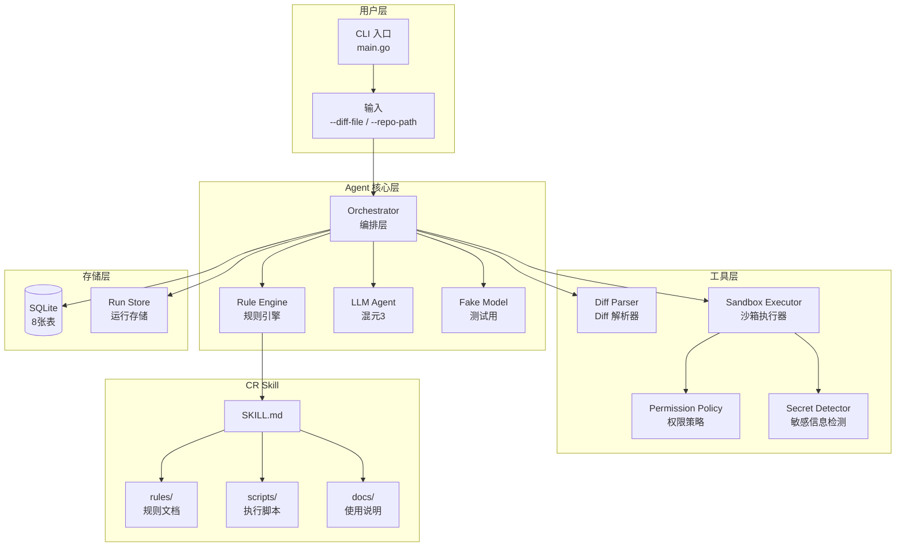
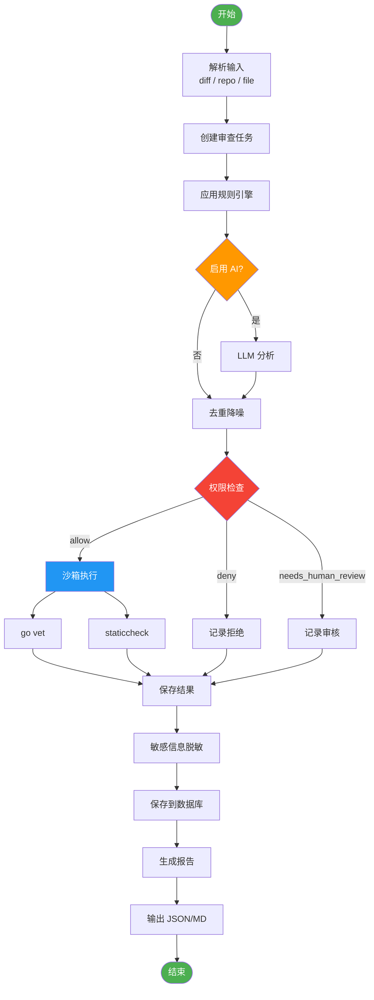
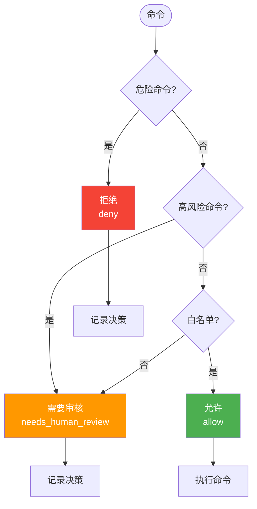
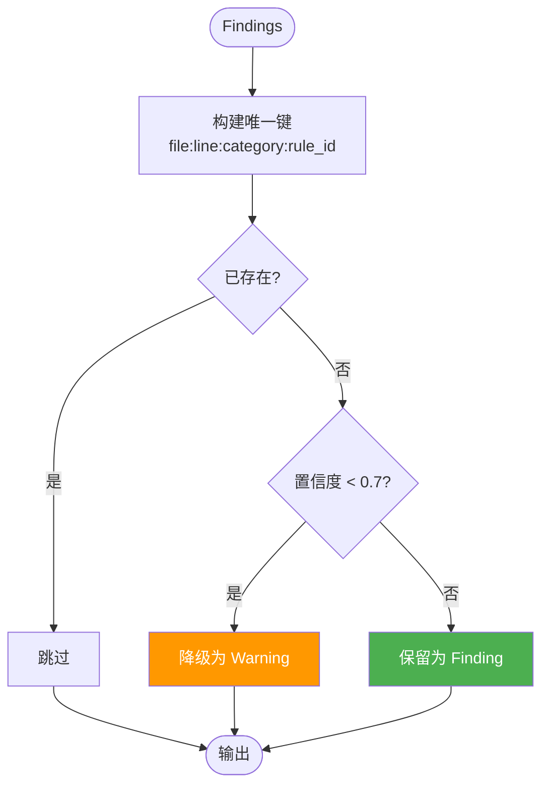
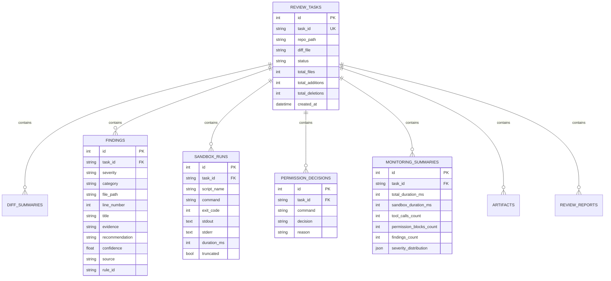
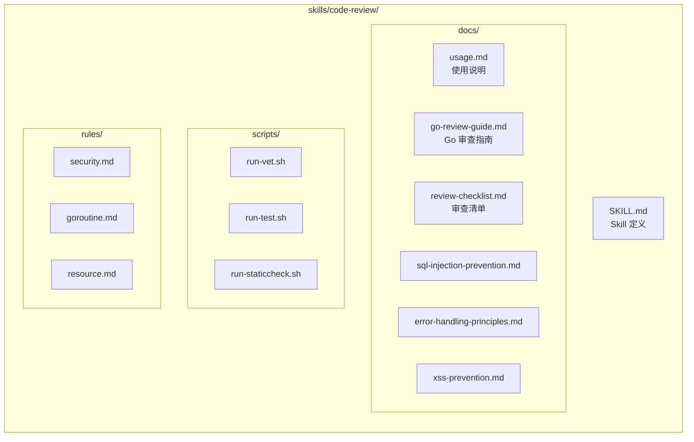
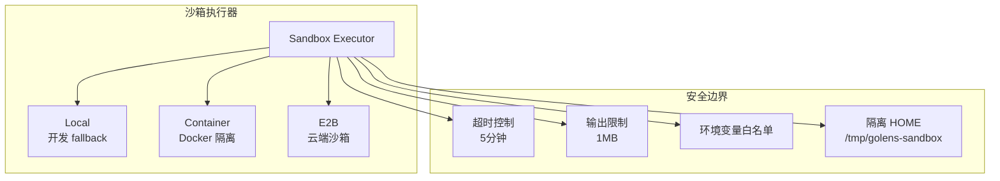

# GoLens 方案设计说明

## 1. 项目概述

GoLens 是一个基于 `trpc-agent-go` 框架的智能代码审查 Agent，面向 Go 项目代码评审场景。系统结合规则引擎和 AI 大模型，通过 Skill 体系封装审查规则，在沙箱环境中执行静态检查，将发现的问题结构化输出并持久化存储。

## 2. 系统架构

### 2.1 整体架构图

### 2.2 模块职责

| 模块 | 职责 | 文件 |
|------|------|------|
| **CLI** | 用户交互入口 | `main.go` |
| **Orchestrator** | 端到端审查流程编排 | `orchestrator/orchestrator.go` |
| **Rule Engine** | 8 条规则检测 | `rules/rules.go` |
| **LLM Agent** | AI 增强分析 | `main.go` (runLLMAnalysis) |
| **Fake Model** | 测试用确定性模型 | `model/fake.go` |
| **Diff Parser** | 解析 unified diff | `input/diff.go` |
| **Sandbox Executor** | 沙箱执行 | `sandbox/sandbox.go` |
| **Permission Policy** | 权限控制 | `safety/safety.go` |
| **Secret Detector** | 敏感信息脱敏 | `safety/safety.go` |
| **Store** | 数据库存储 | `store/store.go` |

## 3. 核心流程

### 3.1 审查主流程

### 3.2 权限决策流程

### 3.3 去重降噪流程

## 4. 数据模型

### 4.1 数据库 ER 图

## 5. CR Skill 设计

### 5.1 Skill 目录结构

### 5.2 审查规则

| 规则 ID | 类别 | 严重级别 | 说明 |
|---------|------|----------|------|
| SEC001 | security | critical | SQL 注入风险 |
| SEC002 | security | critical | 敏感信息泄漏 |
| GR001 | goroutine | high | Goroutine 泄漏 |
| GR002 | goroutine | medium | Context 泄漏 |
| RES001 | resource | high | 资源未关闭 |
| TEST001 | test | low | 测试缺失 |
| DB001 | database | high | 数据库事务问题 |
| GO003 | error | low | 错误包装问题 |

## 6. 沙箱隔离策略

## 7. 安全边界

| 安全措施 | 说明 |
|----------|------|
| **超时控制** | 沙箱执行 5 分钟超时 |
| **输出限制** | 最大 1MB 输出 |
| **环境变量白名单** | 只允许 HOME、PATH、GOPATH 等 |
| **隔离 HOME** | 使用 /tmp/golens-sandbox |
| **敏感信息脱敏** | 自动检测并脱敏 API Key、Token、Password |
| **危险命令拦截** | rm -rf、sudo 等直接拒绝 |
| **解释器拦截** | bash -c、sh -c 等防止绕过 |

## 8. 监控字段

| 字段 | 说明 |
|------|------|
| total_duration_ms | 总耗时 |
| sandbox_duration_ms | 沙箱执行耗时 |
| tool_calls_count | 工具调用次数 |
| permission_blocks_count | 权限拦截次数 |
| findings_count | Finding 数量 |
| severity_distribution | 严重级别分布 |
| exception_distribution | 异常类型分布 |

## 9. 总结

GoLens 通过规则引擎 + AI 增强的混合策略，实现了高效、准确的代码审查。系统架构清晰，模块解耦，具有良好的可扩展性和可维护性，满足自动代码评审 Agent 的各项验收标准。
