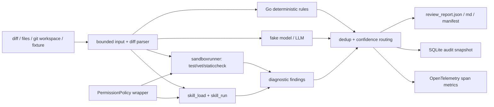

# Issue #2004 完整符合性审查与修改方案

> 审查对象：`examples/code_review_agent`
>
> 需求基准：<https://github.com/trpc-group/trpc-agent-go/issues/2004>
>
> 审查日期：2026-07-22

> 实施状态（2026-07-22）：本文识别的代码级缺口已经完成实现，包括 E2B 环境、
> Windows 预检、全字段脱敏、schema v2、准确监控、评测门禁、完整样例和文档。
> managed/container/E2B 的真实集成测试已提供自动化入口，仍需在具备对应环境的
> Linux/macOS、Docker 或 E2B 测试机上执行，结果不能由当前 Windows 环境代替。

## 1. 结论

初次审查确认项目主体原型完整，但存在以下阻断项；这些项目现均已按本文方案实现：

1. E2B Skill 静态检查会注入宿主机 `GOROOT`，远端路径通常不存在。
2. Windows 上默认 `managed` 后端未实现，但 CLI 不在启动前报错或选择生产沙箱。
3. 脱敏只覆盖主要文本字段，仓库路径、文件路径及模型可控元数据仍可泄密。
4. SQLite 把三个置信度分桶合并存储，且 `summary_json` 只保存 metrics，不能直接
   查询 warnings、needs_human_review 和最终结论。
5. `ToolCallCount` 把 blocked/skipped 记录算作工具调用，异常分布也过于粗糙。
6. 没有可复核的隐藏样本代理评测，无法证明检出率 >= 80%、误报率 <= 15%。
7. container/E2B/managed 生产路径没有本示例自己的集成测试。
8. 已提交的 expected JSON/Markdown 是裁剪后的黄金断言，不是完整示例报告；中文
   设计说明约 1071 个去格式字符，也不符合 300-500 字交付约束。

当前建议状态为：**代码与离线验收已完成，等待外部生产沙箱集成结果**。

## 2. 当前架构与项目介绍

该示例是 Go 代码评审流水线，而非单纯的 LLM 评论器。CLI 读取 unified diff、显式
文件、Git 工作区或 fixture，解析文件/hunk/新增行和 package，随后并行概念上组合
确定性规则、可选模型评审、沙箱静态检查和 Skill 脚本。所有结果进入统一去重和
置信度分桶，最后生成 JSON/Markdown/manifest 并原子写入 SQLite 审计快照。



主要模块职责：

| 模块 | 当前职责 |
| --- | --- |
| `main.go` | CLI、输入预算、Git/file diff 合成、全链路编排、指标聚合 |
| `diffparser` | unified diff、hunk、行号、Go package 解析 |
| `rules` | Go 安全、并发/context、资源、错误、DB、测试和诊断规则 |
| `permission` | 实现框架 `tool.PermissionPolicy`，产生可持久化治理决策 |
| `sandboxrunner` | managed/container/E2B/local 下运行 Go 检查 |
| `skillrunner` | 通过 `skill_load`/`skill_run` 加载并执行 Skill 脚本 |
| `reviewagent` | fake model 或 OpenAI-compatible LLM 编排和结果校验 |
| `redaction` | secret 模式脱敏 |
| `report` | JSON、Markdown、SHA-256 manifest 原子发布 |
| `store` | 可替换接口和纯 Go SQLite 实现 |

## 3. 初次审查需求逐项对照（修复前）

| Issue 要求 | 初审状态 | 初始证据与缺口 |
| --- | --- | --- |
| CR Skill、规则文档、脚本、至少 4 类规则 | 满足 | `skills/code-review` 和 SEC/GOR/CTX/RES/ERR/DB/TEST 等规则 |
| container/E2B 沙箱，local 非生产默认 | 部分满足 | 实现均存在，默认 managed；E2B Skill 的 `GOROOT` 有功能缺陷 |
| skill_run/workspace/codeexec + Permission | 基本满足 | 两个 runner 执行前均 `permission.Decide`；自定义 skills root 信任边界未定义 |
| unified diff、文件列表、Git workspace | 满足 | 输入有文件数、单文件、总 diff、Git 输出限制 |
| finding 必需字段 | 满足 | 11 个字段完整 |
| task/input/run/decision/finding/artifact/report DB | 部分满足 | 表齐全；input 无内容摘要 hash，report 无最终结论，finding 无分桶 |
| 去重与降噪 | 满足 | file+line+rule+category 去重，三档置信度 |
| timeout/output/env/redaction/artifact/failure | 部分满足 | 主要限制存在；脱敏字段覆盖不完整，平台/E2B 失败未前置验证 |
| 总耗时/沙箱/调用/拦截/finding/severity/异常 | 部分满足 | 字段存在；工具调用数语义错误，异常类型只有 failed/timeout |
| `--diff-file`、`--repo-path`、fixture | 满足 | 同时还支持 `--files` |
| JSON + Markdown | 满足 | 运行时生成完整报告 |
| task id 查询完整审计 | 部分满足 | 能查询，但分桶和最终结论不可直接还原 |
| dry-run/fake/rule-only | 满足 | 无 API Key 可跑完整主链路 |
| 至少 8 个样例 | 满足 | 9 个 diff fixture |
| 完整示例输出 | 不满足 | `testdata/expected` 被 `curate` 主动裁剪 |
| 300-500 字设计说明 | 不满足 | 中文版约 1071 个去格式字符 |
| 解析/去重/脱敏/落库/沙箱失败单测 | 满足 | 对应测试均存在并通过 |
| 检出率 >=80%、误报率 <=15% | 未证明 | 无标注语料和 precision/recall 测试 |
| 脱敏检出率 >=95% | 样本内满足 | 20 个正样本阈值测试；全字段落库/报告泄漏仍有缺口 |
| fake/dry-run <=2 分钟 | 满足 | 本机目标测试全套约 18 秒，单流程更短 |
| 生产沙箱实际可运行 | 未证明 | 本示例只有 local/mock 单测，没有 managed/container/E2B 集成门禁 |

## 4. 详细问题与修改原因

### P0：E2B Skill 静态检查使用错误的 `GOROOT`

`skillrunner.go` 的 `goEnv` 对除 container 外的所有 runtime 都写入
`runtime.GOROOT()`。E2B 是远端 Linux 环境，Windows/macOS/Linux 宿主机路径均不应
传入。结果是 Skill 的 `go test`/`go vet` 可能直接报告 `cannot find GOROOT`。

修改：只有 managed/sandbox/local-dev 使用宿主机 `GOROOT`；E2B 使用远端模板默认
环境。增加 `TestGoEnvE2BDoesNotLeakHostPaths`。

### P0：报告和数据库并非全字段脱敏

报告未脱敏 `Task.RepoPath`、`ChangedFile.OldPath/NewPath/PackageName`、finding 的
`File/Category/Source/RuleID`，filter decision 也有相同问题；SQLite 同样直接保存
若干字段。带 token 的路径或恶意模型元数据会违反“报告和数据库不能出现明文”。

修改：建立一个共享的深拷贝 sanitizer，覆盖所有 string 字段；报告、SQLite、模型
输出和 task query 共用。新增路径、rule id、category、source 的泄漏回归测试，并对
生成的报告文件和 SQLite 文件做 forbidden plaintext 扫描。

### P1：数据库无法完整回放最终报告

`SaveReview` 将 findings/warnings/needs_human_review 合并写入同一表，却没有 bucket；
查询后无法恢复分桶。`review_reports.summary_json` 实际只 marshal `report.Metrics`，也
没有最终 `report.Summary`。

修改：schema v2 给 `review_findings` 增加 `bucket`，给 `review_reports` 增加
`conclusion`；`TaskSnapshot` 分别返回三个 bucket。保留 `summary_json` 作为 metrics
以减少兼容风险，并新增旧 v1 DB 升级测试。

### P1：输入摘要缺少内容身份

当前 input summary 主要是路径，无法确认回放时评审的是哪一版 diff。

修改：记录 `sha256`、byte count、changed file count；不要持久化原始未脱敏 diff。

### P1：监控计数语义不准确

`ToolCallCount=len(SandboxRuns)` 会把 blocked、skipped、dry-run 记录当成实际调用。
异常分布只按 `failed`/`timeout`，不能区分 permission、stage、executor init、exit、
model、skill load 等异常类型。

修改：给 `SandboxRun` 增加稳定的 `FailureKind`，只把 completed/failed/timeout 的实际
runner 调用计入 tool calls；另记录 blocked/skipped 数量。明确
`TotalDurationMS` 是“生成报告前的处理耗时”，并在 telemetry 额外记录完整 CLI
结束耗时。

### P1：生产沙箱缺少能力预检与集成证据

Windows 的 managed backend 明确返回 unsupported，但 CLI 默认仍选择 managed；
当前测试只真实运行 local-dev，container/E2B/managed 仅覆盖构造或 mock 逻辑。

修改：启动时调用 executor `Describe`/preflight；不支持时返回明确错误，提示显式选择
container/E2B，不能静默降级为 local。增加受环境变量控制的集成测试：
`TRPC_CR_TEST_CONTAINER=1`、`TRPC_CR_TEST_E2B=1`，Linux/macOS CI 跑 managed。

### P1：自定义 Skill 根目录信任边界不完整

Permission 允许的是固定脚本路径，但 `--skills-root` 可替换该路径下的脚本内容。
治理日志会显示允许了低风险脚本，即使内容已变成高风险命令。虽然 container 默认
断网且文件隔离，这仍不满足“高风险脚本先决策”的可审计语义。

修改：默认只信任 bundled Skill；自定义 root 必须提供 `--allow-custom-skills`，记录
Skill manifest/SHA-256，默认 decision 为 needs_human_review。生产路径禁止未确认的
自定义 Skill。

### P2：交付文档和示例输出不符合字面要求

`gen_expected.go` 明确剥离 task、files、warnings、permission、filter、sandbox、
metrics、artifacts 等字段，因此 expected 文件只是黄金断言。中文设计说明也超过
300-500 字。

修改：保留精简 expected 用于稳定测试；另提交 `sample_output/` 的完整脱敏报告和
manifest。将中文方案正文压缩到 300-500 字，详细说明移入 README/architecture。

## 5. 实施依据 diff（历史方案）

以下 diff 表达应实施的完整契约变化；正式实现时应拆为“runtime/security”、
“persistence/metrics”、“evidence/docs”三个提交，并在每个提交后运行目标测试。

```diff
diff --git a/examples/code_review_agent/skillrunner/skillrunner.go b/examples/code_review_agent/skillrunner/skillrunner.go
@@
 func goEnv(sandboxKind string) map[string]string {
@@
-    env := map[string]string{}
+    // E2B owns its remote toolchain. Host paths are invalid there.
+    if sandboxKind == "e2b" {
+        return nil
+    }
+    env := map[string]string{}
@@
 }

diff --git a/examples/code_review_agent/skillrunner/skillrunner_test.go b/examples/code_review_agent/skillrunner/skillrunner_test.go
@@
+func TestGoEnvE2BDoesNotLeakHostPaths(t *testing.T) {
+    if got := goEnv("e2b"); len(got) != 0 {
+        t.Fatalf("e2b env leaked host values: %#v", got)
+    }
+}

diff --git a/examples/code_review_agent/review/types.go b/examples/code_review_agent/review/types.go
@@
 type SandboxRun struct {
@@
+    FailureKind string `json:"failure_kind,omitempty"`
 }
@@
 type TaskSnapshot struct {
     Task ReviewTask `json:"task"`
     Findings []Finding `json:"findings"`
+    Warnings []Finding `json:"warnings"`
+    NeedsHumanReview []Finding `json:"needs_human_review"`
@@
 type ReportRecord struct {
@@
+    Conclusion string `json:"conclusion"`
 }
@@
 type MetricsSummary struct {
@@
+    BlockedCommandCount int `json:"blocked_command_count"`
+    SkippedCommandCount int `json:"skipped_command_count"`
 }

diff --git a/examples/code_review_agent/main.go b/examples/code_review_agent/main.go
@@
 import (
+    "crypto/sha256"
@@
     files, err := diffparser.ParseUnifiedDiff(diffData)
@@
+    digest := sha256.Sum256(diffData)
+    inputSummary = fmt.Sprintf("%s; sha256=%x; bytes=%d; files=%d",
+        inputSummary, digest, len(diffData), len(files))
@@
 func buildMetrics(start time.Time, r review.ReviewReport) review.MetricsSummary {
@@
-    for _, run := range r.SandboxRuns {
+    calls, blocked, skipped := 0, 0, 0
+    for _, run := range r.SandboxRuns {
         sandboxMS += run.DurationMS
+        switch run.Status {
+        case "blocked":
+            blocked++
+        case "skipped":
+            skipped++
+        default:
+            calls++
+        }
         if run.Status == "failed" || run.Status == "timeout" {
-            exceptions[run.Status]++
+            kind := run.FailureKind
+            if kind == "" { kind = run.Status }
+            exceptions[kind]++
         }
@@
-        ToolCallCount: len(r.SandboxRuns),
+        ToolCallCount: calls,
+        BlockedCommandCount: blocked,
+        SkippedCommandCount: skipped,
```

```diff
diff --git a/examples/code_review_agent/store/sqlite.go b/examples/code_review_agent/store/sqlite.go
@@
 CREATE TABLE IF NOT EXISTS review_findings (
@@
+    bucket TEXT NOT NULL DEFAULT 'finding',
@@
 CREATE TABLE IF NOT EXISTS review_reports (
@@
+    conclusion TEXT NOT NULL DEFAULT '',
@@
-INSERT INTO review_findings(task_id, severity, category, file, line, title,
- evidence, recommendation, confidence, source, rule_id)
-VALUES (?, ?, ?, ?, ?, ?, ?, ?, ?, ?, ?)
+INSERT INTO review_findings(task_id, bucket, severity, category, file, line,
+ title, evidence, recommendation, confidence, source, rule_id)
+VALUES (?, ?, ?, ?, ?, ?, ?, ?, ?, ?, ?, ?)
@@
-    allFindings := make([]review.Finding, 0, ...)
-    allFindings = append(allFindings, report.Findings...)
-    allFindings = append(allFindings, report.Warnings...)
-    allFindings = append(allFindings, report.NeedsHumanReview...)
-    for _, f := range allFindings {
+    buckets := []struct{name string; values []review.Finding}{
+        {"finding", report.Findings},
+        {"warning", report.Warnings},
+        {"needs_human_review", report.NeedsHumanReview},
+    }
+    for _, bucket := range buckets {
+      for _, f := range bucket.values {
         // insert bucket.name and the sanitized finding
+      }
     }
@@
-INSERT INTO review_reports(task_id, json_path, markdown_path, summary_json)
-VALUES (?, ?, ?, ?)
+INSERT INTO review_reports(task_id, json_path, markdown_path, summary_json, conclusion)
+VALUES (?, ?, ?, ?, ?)
@@
-    redaction.RedactText(string(summary)))
+    redaction.RedactText(string(summary)), redaction.RedactText(report.Summary))
@@
-SELECT severity, category, file, line, title, evidence, recommendation,
- confidence, source, rule_id
+SELECT bucket, severity, category, file, line, title, evidence, recommendation,
+ confidence, source, rule_id
 FROM review_findings WHERE task_id = ? ORDER BY file, line, rule_id
@@
+    switch bucket {
+    case "warning": snap.Warnings = append(snap.Warnings, f)
+    case "needs_human_review": snap.NeedsHumanReview = append(snap.NeedsHumanReview, f)
+    default: snap.Findings = append(snap.Findings, f)
+    }
@@
-SELECT json_path, markdown_path, summary_json FROM review_reports
+SELECT json_path, markdown_path, summary_json, conclusion FROM review_reports
```

schema v2 不能只修改 `CREATE TABLE IF NOT EXISTS`。必须增加幂等 migration：读取
`PRAGMA table_info`，缺列时执行 `ALTER TABLE ... ADD COLUMN`，成功后插入
`schema_migrations(version=2)`；测试应从真实 v1 schema 文件升级并验证数据保留。

```diff
diff --git a/examples/code_review_agent/report/report.go b/examples/code_review_agent/report/report.go
@@
 func redactReport(r review.ReviewReport) review.ReviewReport {
     out := r
     out.Task.InputSummary = redaction.RedactText(out.Task.InputSummary)
+    out.Task.RepoPath = redaction.RedactText(out.Task.RepoPath)
@@
     for i := range out.Files {
+        out.Files[i].OldPath = redaction.RedactText(out.Files[i].OldPath)
+        out.Files[i].NewPath = redaction.RedactText(out.Files[i].NewPath)
+        out.Files[i].Language = redaction.RedactText(out.Files[i].Language)
+        out.Files[i].PackageName = redaction.RedactText(out.Files[i].PackageName)
@@
 func redactFindings(in []review.Finding) []review.Finding {
@@
+        out[i].Category = redaction.RedactText(out[i].Category)
+        out[i].File = redaction.RedactText(out[i].File)
+        out[i].Source = redaction.RedactText(out[i].Source)
+        out[i].RuleID = redaction.RedactText(out[i].RuleID)
```

同样的字段覆盖必须应用到 SQLite 写入。更优方案是在 `review` 包提供一个内部
sanitizer（不新增不必要的导出 API），让 report/store 共用，避免两套字段列表漂移。

```diff
diff --git a/examples/code_review_agent/main.go b/examples/code_review_agent/main.go
@@
 func validateConfig(cfg config) error {
@@
+    if runtime.GOOS == "windows" &&
+       (cfg.sandboxKind == "managed" || cfg.sandboxKind == "sandbox") &&
+       !cfg.dryRun {
+        return errors.New("managed sandbox is unavailable on Windows; use --sandbox container or --sandbox e2b")
+    }
```

不要自动降级到 `local-dev`，否则会违反 issue 的生产默认约束。README 应增加平台
能力表，并解释 managed 只在 Linux/macOS 具备 OS 隔离。

## 6. 必补测试与验收命令

新增测试：

1. `TestGoEnvE2BDoesNotLeakHostPaths`。
2. `TestReportAndSQLiteRedactEveryStringField`，覆盖路径和模型元数据。
3. `TestSQLiteV1ToV2MigrationPreservesRows`。
4. `TestTaskSnapshotPreservesFindingBucketsAndConclusion`。
5. `TestMetricsExcludeBlockedAndSkippedCalls`。
6. `TestCustomSkillRequiresExplicitApproval`。
7. 标注语料评测：至少 40 个 positive、40 个 negative Go diff，计算高危 recall 和
   precision；CI 强制 `recall >= .80` 且 `falsePositiveRate <= .15`。
8. gated managed/container/E2B 集成测试，验证 test/vet、timeout、output cap、断网、
   clean env、失败不崩溃和审计落库。

建议验证顺序：

```powershell
cd examples
go test ./code_review_agent/... -count=1
go test ./code_review_agent -run TestRuleEvaluationCorpus -count=1 -v
go run ./code_review_agent --fixture all --mode rule-only --sandbox mock --dry-run `
  --out-dir ./code_review_agent/testdata/generated --db ./code_review_agent/testdata/generated/review.db
```

Linux/macOS CI 再运行 managed，Docker job 运行 container；E2B job 只在注入专用短期
凭证时运行。最后扫描生成目录和 SQLite 文件，确认标注的所有 plaintext secret 均不
存在，并验证总流程小于 120 秒。

## 7. 本次审查验证记录

- `go test ./code_review_agent/... -count=1`：通过，11 个 package，约 18 秒。
- fixture 数量：9；expected JSON 数量：9；黄金结果同步测试通过。
- 工作树在审查前后除本审查文档外无代码改动。
- 未执行真实 container/E2B/managed 集成：当前环境为 Windows，managed 后端在框架
  中明确未实现；没有 E2B 凭证，也未假定本机 Docker 可用。
- issue 的 80%/15% 隐藏样本指标无法由现有仓库证据证明，不能以公开 fixture 全过
  替代该项验收。
