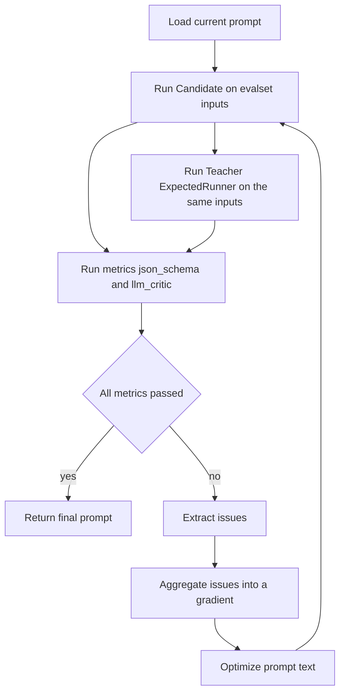

# PromptIter evaluation driven prompt iteration example

This example shows how to drive automated prompt iteration with an evaluation system. It runs a fixed evalset to produce Candidate outputs, generates dynamic reference outputs with a Teacher model through ExpectedRunner, uses an LLM Judge to produce actionable issues, aggregates issues into a compact gradient, and asks an Optimizer model to propose an updated prompt. The loop repeats until all metrics pass or the round limit is reached.

The demo task is sports flash news generation. The input is a game status JSON string. The output must be a strict JSON object with only the `content` field. The content must be a Chinese news flash written only from the input fields, with no fabrication.

## What you get

The program prints the final prompt to stdout.

If the final prompt passes all metrics, the program exits with status code `0`.

If the final prompt still fails after the maximum optimization rounds, the program exits with status code `1`.

## Background and design

In real workloads, common prompt failure modes often fall into two categories:

- Output contract is unstable with extra fields, extra text, or inconsistent formatting
- Fact boundary is unclear and the model produces narratives beyond what can be verified from inputs

This example makes both failure modes explicit in evaluation, and turns fixes into a repeatable prompt improvement loop.

### Metrics

This example runs two metrics by default. The configuration is in `data/sportscaster_eval_app/sportscaster_basic.metrics.json`:

- `json_schema` validates the final output with `schema/candidate.json` and requires a single JSON object with only `content`
- `llm_critic` uses a Judge model to compare Candidate output with Teacher reference output and produces prompt oriented issues

### Roles

- Candidate is the target to optimize. It is called by evaluation to produce actual outputs
- Teacher is the reference answer generator. It is injected into evaluation as ExpectedRunner to produce expected outputs
- Judge is the evaluator model used by `llm_critic`. It reads `prompt/llmcritic.md` and produces structured critiques
- Aggregator turns per case issues into a compact aggregated gradient. It reads `prompt/aggregator.md`
- Optimizer proposes an updated prompt text. It reads `prompt/optimizer.md` and returns the updated prompt text directly

## Architecture overview

The core of this example is a small driver that wires evaluation and iteration into a single loop. Entry is in `examples/evaluation/promptiter/main.go` and wiring is in `examples/evaluation/promptiter/workflow.go`. The reusable workflow implementation lives in `evaluation/workflow/promptiterator`.

### Data flow



## Execution flow in detail

### One optimization round

```mermaid
sequenceDiagram
  participant Iter as PromptIterator
  participant Eval as Evaluation
  participant Cand as Candidate
  participant Teach as ExpectedRunner
  participant Judge as LLM Judge
  participant Agg as Aggregator
  participant Opt as Optimizer

  Iter->>Eval: Evaluate evalsets with current prompt instruction
  Eval->>Cand: Run inference for actual outputs
  Eval->>Teach: Run inference for expected outputs
  Eval->>Judge: Score and generate issues with llm_critic
  Eval-->>Iter: Evaluation results

  Iter->>Agg: Aggregate extracted issues
  Agg-->>Iter: aggregated_gradient

  Iter->>Opt: current_prompt and aggregated_gradient
  Opt-->>Iter: updated prompt text

  Note over Iter: The loop repeats until pass or max rounds reached
```

### 1. Startup and config loading

- Command line flags are parsed in `examples/evaluation/promptiter/main.go` and defaults are in `examples/evaluation/promptiter/config.go`
- Evalset files under `-data-dir` provide input samples. Metrics files provide metric definitions and rubrics

### 2. Candidate inference and metric evaluation

- Evaluation runs each evalset
- Candidate output is validated by `json_schema` using `schema/candidate.json`
- When `expectedRunnerEnabled` is enabled for a case, evaluation uses ExpectedRunner to generate expected outputs for the same inputs
- `llm_critic` builds the Judge input from user input, Candidate output, Teacher output, and rubrics from metrics definition
- Judge output must conform to `schema/llmcritic.json`

### 3. Issue extraction, aggregation, and optimization

- PromptIterator extracts normalized issues from evaluation results
- Aggregator converts raw issues into a compact aggregated gradient
- Optimizer takes `current_prompt` and `aggregated_gradient` and returns a new prompt text

If all metrics pass, the run stops early and no further optimization rounds are executed.

## Prerequisites

### Dependencies

- Go 1.21 or newer
- An accessible model service

### Environment variables

This example uses an OpenAI compatible provider by default. You need a valid API key and an optional base URL.

| Variable | Meaning | Default |
| --- | --- | --- |
| `OPENAI_API_KEY` | Model provider API key | empty |
| `OPENAI_BASE_URL` | Model provider base URL | `https://api.openai.com/v1` |

`OPENAI_API_KEY` is required. If you use the official OpenAI endpoint, you can omit `OPENAI_BASE_URL`.

## Run

From the repository root:

```bash
cd examples/evaluation/promptiter
export OPENAI_API_KEY="sk-..."
export OPENAI_BASE_URL="https://api.openai.com/v1"
go run .
```

Specify the model names for Candidate and Teacher:

```bash
cd examples/evaluation/promptiter
export OPENAI_API_KEY="sk-..."
go run . -candidate-model "gpt-4o-mini" -teacher-model "gpt-5.2"
```

Run only selected evalsets. The flag can be provided multiple times or as a comma separated list:

```bash
cd examples/evaluation/promptiter
export OPENAI_API_KEY="sk-..."
go run . -evalset sportscaster_basic
```

## Command line flags

| Flag | Description | Default |
| --- | --- | --- |
| `-app` | App name used to locate evalsets and metrics under `-data-dir` | `sportscaster_eval_app` |
| `-evalset` | Evalset id, can be repeated or comma separated. When omitted, runs all evalsets under the app | empty |
| `-data-dir` | Data directory containing `.evalset.json` and `.metrics.json` | `./data` |
| `-schema` | JSON Schema path for Candidate output | `./schema/candidate.json` |
| `-iters` | Max iteration rounds | `3` |
| `-candidate-model` | Candidate model name | `deepseek-v3.2` |
| `-teacher-model` | Teacher model name | `gpt-5.2` |
| `-judge-model` | Judge model name | `gpt-5.2` |

## Model configuration notes

This example calls multiple model roles in a single run. If your model provider does not offer the default model names in this document, change them to the model names available to you.

- Candidate model is controlled by `-candidate-model`
- Teacher model is controlled by `-teacher-model`
- Judge model is controlled by `-judge-model`, and injected into evaluation via a shared Judge runner
- Aggregator and Optimizer model names are set in the default config in `examples/evaluation/promptiter/config.go`, and there are no command line flags for them yet

## Directory layout

### Data and prompts

```text
examples/evaluation/promptiter/
├── data/
│   └── sportscaster_eval_app/
│       ├── sportscaster_basic.evalset.json
│       └── sportscaster_basic.metrics.json
├── prompt/
│   ├── candidate.md
│   ├── teacher.md
│   ├── llmcritic.md
│   ├── aggregator.md
│   └── optimizer.md
└── schema/
    ├── candidate.json
    ├── llmcritic.json
    └── aggregator.json
```

## Iteration loop

Each iteration follows the same closed loop:

1. Load current prompt text
2. Run evaluation inference and scoring with the current prompt as Candidate instruction
3. Extract per case issues from evaluation results
4. Call Aggregator to produce an aggregated gradient
5. Call Optimizer to produce the next prompt text
6. Use the updated prompt as the next round input

If all metrics pass, the run stops early and no further iterations are executed.

## Extending this example

You can extend it in three directions:

- Expand evalsets: add or modify `.evalset.json` under `data/sportscaster_eval_app` to cover missing fields, conflicting fields, and edge cases
- Adjust metrics and rubrics: strengthen or add rubrics in `.metrics.json` to make Judge produce more stable and actionable issues
- Replace task and schema: modify `schema/candidate.json` and prompts under `prompt` to migrate the closed loop to your own output contract
