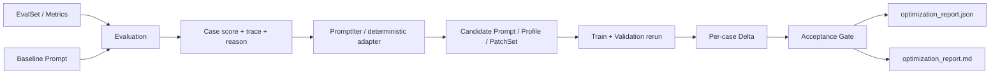
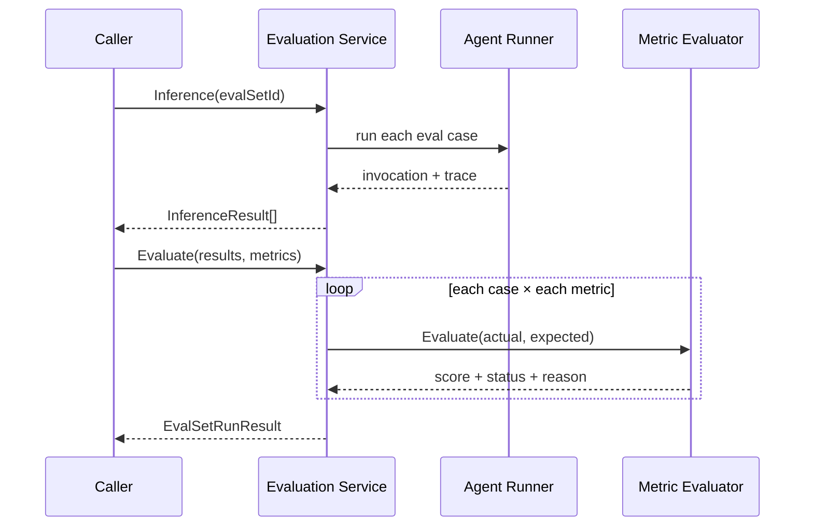
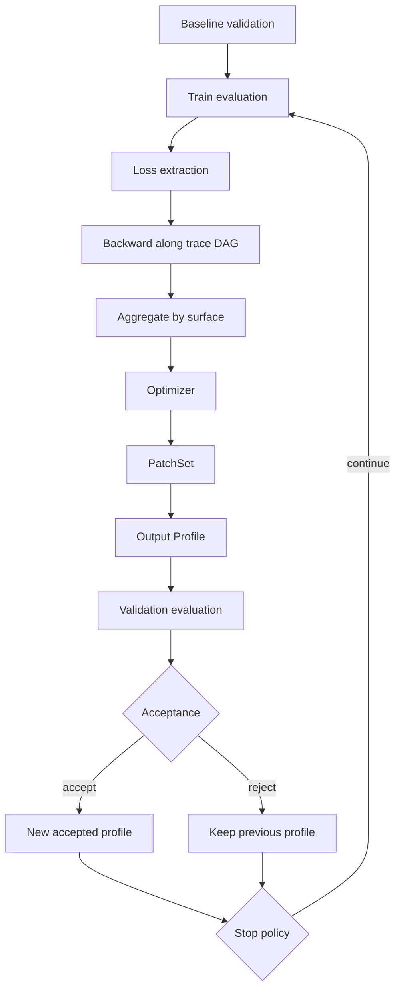

# tRPC-Agent-Go Evaluation、PromptIter 与赛题方案学习指南

> 本文面向第一次接触 Agent 评测与 Prompt 自动优化的开发者，也可作为本赛题实现的代码导读。阅读目标不是只学会运行示例，而是理解：为什么需要评测闭环、Evaluation 与 PromptIter 各自负责什么、本方案补齐了哪些生产级安全约束，以及核心 Go 代码如何把这些约束落实为可验证的不变量。

## 阅读前速览：用“考试、教练和发布审核”理解整个项目

如果暂时不熟悉 Evaluation、PromptIter、trace 或 gate，可以先把整个系统想象成一所学校：

| 项目概念 | 通俗类比 | 实际职责 |
|---|---|---|
| Agent | 参加考试的学生 | 接收用户问题，调用工具并生成答案 |
| Prompt | 学生使用的答题方法 | 告诉 Agent 应如何分析、路由、调用工具和组织输出 |
| EvalSet | 一套试卷 | 保存输入、标准答案和过程要求 |
| Metric | 每道题的评分细则 | 分别检查答案、工具、参数、路由、格式和知识证据 |
| Evaluation | 阅卷系统 | 运行 Agent、收集过程、计算分数和失败原因 |
| Trace | 答题草稿和操作录像 | 记录 Agent 每一步做了什么、花了多久、是否失败 |
| PromptIter | 教练 | 根据错题和答题过程提出新的答题方法 |
| Train set | 教练能看到的练习题 | 用于发现问题和生成改进建议 |
| Validation set | 教练不能针对性背答案的模拟考试 | 检查新方法能否泛化以及是否伤害其他能力 |
| Gate | 发布审核委员会 | 即使总分提高，也检查关键题、严重错误和成本预算 |
| Audit report | 完整成绩单和监考记录 | 解释改了什么、为何接受或拒绝、证据来自哪里 |

一句话概括：Evaluation 告诉我们“哪里做错了”，PromptIter 尝试提出“以后应该怎么做”，validation 和 gate 决定“这个改法能不能安全上线”。

### 一个最小例子

假设用户问：“深圳今天多少度？”Agent 应调用：

```json
{"tool": "weather", "arguments": {"city": "深圳"}}
```

Baseline Prompt 写得不够清楚，Agent 却沿用了上一条样本的参数：

```json
{"tool": "weather", "arguments": {"city": "上海"}}
```

即使它最后碰巧回复“深圳 28℃”，系统也不能只看最终文本后判满分。完整闭环会这样处理：

1. tool trajectory 发现工具名正确、参数错误；
2. failure attribution 给出 `tool_parameter_error`；
3. PromptIter 提出“工具参数必须从当前请求提取，不得复用历史样本”；
4. train 中的深圳 case 重新执行；
5. validation 再用一个优化器没直接见过的城市，例如广州；
6. 若深圳和广州都正确，说明规则有一定泛化性；
7. 若其他关键 case 没退化且预算合格，gate 才允许接受。

这也解释了为什么“直接在 Prompt 里写死深圳”不是好优化：它可能修复训练题，却无法通过广州验证题。

### 初学者只需要先记住四个原则

1. **结果和过程都要评。** 最终答案正确不代表工具、路由和证据正确。
2. **训练提高不等于真正提高。** 必须看隔离的 validation。
3. **平均分不能掩盖严重错误。** critical case 和 hard fail 是不可补偿约束。
4. **每个分数都要能追溯。** Prompt、输出、trace、usage 和报告必须属于同一次运行。

### 常用术语速查

| 术语 | 通俗解释 |
|---|---|
| Baseline | 修改前的基准 Prompt 和它的成绩 |
| Candidate | 优化器提出、尚待验证的新 Prompt |
| Case | 一条独立测试场景，相当于一道题 |
| Split | 数据集分区，例如 train 或 validation |
| Inference | 让 Agent 真正执行一次输入并产生输出 |
| Metric | 从某个角度评分的规则 |
| Rubric | 用自然语言描述的质量标准，常由 LLM judge 执行 |
| Threshold | 达到多少分才算该 metric 或 case 通过 |
| Weight | 某项 metric 在综合分里的占比 |
| Hard fail | 不能被其他高分补偿的一票否决失败 |
| Critical case | 业务上禁止退化的关键测试 |
| Trace | Agent 路由、工具、检索和回复的逐步执行记录 |
| Tool trajectory | 按顺序记录的工具名、参数和结果 |
| Loss | 从失败 metric 提炼出的优化问题 |
| Gradient | loss 对某个可优化 surface 的修改方向，不是神经网络参数梯度 |
| Surface | Agent 结构中允许被优化的具体文本位置 |
| Patch | 对某个 surface 提出的替换内容 |
| Profile | 应用了若干 override 的候选 Agent 配置 |
| Delta | Candidate 减 Baseline 的分数或成本变化 |
| Gate | 接受候选前必须全部满足的确定性检查 |
| Provenance | 结果来源证明，即输出究竟由哪个 Prompt 和运行产生 |
| Fallback | 找不到候选输出时回用基线输出；validation 中被禁止 |
| Fail closed | 信息缺失或矛盾时默认拒绝，而不是默认放行 |
| Audit | 保存 Prompt、输出、分数、理由和成本以便追溯 |

特别注意：PromptIter 中的“梯度”是语言层面的修改建议，例如“工具参数应从当前用户输入提取”，不是对模型权重做反向传播，也不会训练大模型参数。

## 1. 先建立全局认识

### 1.1 这个问题真正要解决什么

普通的 Prompt 优化流程常常只有两步：修改 Prompt，然后看一个总分是否提高。它有三个明显风险：

1. 训练样本提高，但未见样本退化，即过拟合。
2. 平均分提高，但关键业务 case 或 hard-fail 指标退化。
3. 报告只保留最终分数，无法证明候选 Prompt、模型输出、trace 与分数属于同一次运行。

赛题要求的是完整闭环：

```text
Baseline 评测
  → 失败归因
  → PromptIter 生成候选
  → train/validation 重新评测
  → 逐 case 对比
  → 安全门禁
  → JSON/Markdown 审计
```

因此，“分数变高”只是必要条件之一。候选能否被接受，还取决于验证集、关键 case、hard fail、调用成本、trace 完整性和输出来源是否可信。

### 1.2 三层架构关系

本项目可以分成三层理解：

| 层次 | 主要目录 | 职责 |
|---|---|---|
| Evaluation 基础设施 | `evaluation/evalset`、`metric`、`evaluator`、`service`、`evalresult` | 运行 Agent、收集输出和 trace、按 metric 打分、保存结果 |
| PromptIter 优化引擎 | `evaluation/workflow/promptiter` | 从训练失败提取 loss，沿 trace 反向归因，聚合梯度，生成 patch，再用验证集决定是否接受 |
| 赛题回归闭环扩展 | `evaluation/workflow/promptiter/regression` | 增加确定性运行、细粒度失败归因、逐 case delta、严格 gate、来源绑定和审计报告 |



一个重要边界是：仓库原生 PromptIter 是可接真实模型和真实 Evaluation Service 的通用优化引擎；赛题的 `regression` 包是其上层的离线、可复现、安全回归适配。两者共享 `Profile`、`PatchSet`、surface 等领域概念，但不应混为同一实现。

## 2. Evaluation：把 Agent 行为变成可回归信号

### 2.1 为什么 Agent 评测比普通函数测试更复杂

普通函数通常比较输入和确定输出。Agent 的结果至少包含：

- 最终回复；
- 工具选择、工具参数和工具结果；
- router 或 sub-agent 路由；
- 知识检索结果；
- JSON/XML/YAML 等结构化输出；
- 多步执行 trace；
- 模型调用、工具调用、token、成本和时延。

只比较最终字符串，会漏掉“答案碰巧对但过程错误”的情况。例如 Agent 用错订单号调用工具，却在最终回复里猜对了答案。工具轨迹 metric 应将它判为失败，且失败归因应指向参数而不是泛化为“回复不好”。

### 2.2 Evaluation 的核心数据模型

初学者可以把这些类型理解成一条逐渐加工的数据流水线：

```text
EvalCase（题目与标准答案）
  → Invocation（某一次问答/工具调用记录）
  → InferenceResult（Agent 真正做出的结果）
  → MetricResult（单项评分）
  → CaseResult（单题总成绩）
  → EvalSetResult（整套试卷成绩）
```

类型很多并不是为了复杂化，而是为了让“输入是什么、实际执行了什么、如何评分、为什么失败”彼此分离。若把这些内容都塞进一个大结构，后续很难判断某个字段究竟是期望值、实际值还是派生值。

#### EvalSet 与 EvalCase

入口定义在 [`evaluation/evalset`](../../../evaluation/evalset/evalset.go)。`EvalSet` 是 case 集合，`EvalCase` 描述单个场景。一个 case 通常包含用户输入、期望 final response、期望工具轨迹、rubric，以及可选的 trace-mode 实际对话。

```go
type EvalSet struct {
    EvalSetID string
    EvalCases []*EvalCase
}
```

赛题扩展的 [`EvalCase`](../../../evaluation/workflow/promptiter/regression/types.go) 保留标准 `evalset.Invocation` 形状，同时增加：

- `Critical`：关键 case 标记；
- `Expectations`：route、格式、必需知识和最少文档数；
- `FakeResponses`：不同 Prompt 变体对应的确定性输出。

这种设计不是另起炉灶，而是在标准 evalset 不能表达的离线场景信息上做加法。

#### Invocation

`Invocation` 是一次 Agent 交互的期望或实际记录。它可以同时携带 final response 和工具轨迹。Evaluation 的 evaluator 接口接收 actual invocations 与 expected invocations：

```go
Evaluate(
    ctx context.Context,
    actuals, expecteds []*evalset.Invocation,
    evalMetric *metric.EvalMetric,
) (*EvaluateResult, error)
```

接口位于 [`evaluation/evaluator/evaluator.go`](../../../evaluation/evaluator/evaluator.go)。这种拆分让 final-response、tool-trajectory、LLM rubric 等 evaluator 可以独立注册。

#### Metric

[`metric.EvalMetric`](../../../evaluation/metric/metric.go) 主要包含：

- `MetricName`：metric 实例名；
- `EvaluatorName`：路由到哪个 evaluator；
- `Threshold`：通过阈值；
- `Criterion`：ROUGE、LLM rubric 等具体准则。

本赛题的本地 metric 配置额外加入 `Weight` 和 `HardFail`：

```go
type MetricConfig struct {
    MetricName string
    Threshold  float64
    Weight     float64
    HardFail   bool
}
```

这使单 case 总分可以做加权平均，同时表达“即使平均分尚可，只要工具轨迹或路由失败就必须失败”。

### 2.3 Evaluation Service 的控制流

[`service.Service`](../../../evaluation/service/service.go) 把执行拆成两个阶段：

1. `Inference`：运行 Agent，得到 `InferenceResult`，其中包含实际 invocation、session、状态和 execution trace。
2. `Evaluate`：使用配置的 metrics 对 inference result 打分，得到 `EvalSetRunResult`。



本地实现见 [`evaluation/service/local/local.go`](../../../evaluation/service/local/local.go)。其中值得关注的设计包括：

- 输入、manager、registry 都先校验；
- case 可串行或受控并行；
- 单 case 推理失败会转成失败结果，而不是伪造分数；
- metric 扩展先由 registry 解析；
- callback 能观察 set/case 的前后阶段；
- trace 会与 actual invocation 对齐后交给需要 trace 的 rubric。

### 2.4 Trace mode 的意义

Trace mode 的核心思想是“重放已有执行证据，不再调用真实 Agent”。它适合：

- CI 中无 API Key 的回归；
- 对生产事故 trace 做离线复盘；
- 固定 Agent 行为，只验证 metric、归因或 gate；
- 避免模型随机性掩盖实现 bug。

但 trace mode 只有在证据完整时才可信。本赛题的严格 trace 校验要求：

- step kind 和 status 必须属于已知集合；
- `elapsedMs` 非负且单调；
- route、tool input/result、retrieval facts 必须与输出一致；
- 工具和模型调用数必须与 usage 一致；
- 最后一步必须是成功或失败的 `llm/final_response`；
- terminal usage、rubric、latency 必须与顶层结果一致；
- 失败工具后必须有匹配错误消息的失败终态。

实现集中在 [`normalizeTraceReplayOutput`](../../../evaluation/workflow/promptiter/regression/evaluator.go)。原则是 fail closed：缺证据或证据互相矛盾时直接报错，而不是猜测。

## 3. PromptIter：把评测失败变成可验证的 Prompt Patch

### 3.1 Surface、Profile 与 PatchSet

PromptIter 不应任意改写整个 Agent。它先把可优化内容暴露为 surface，例如：

- system/global instruction；
- agent instruction；
- router prompt；
- skill 描述；
- tool 描述。

`Profile` 表示在基线结构上的候选覆盖：

```go
type Profile struct {
    StructureID string
    Overrides   []SurfaceOverride
}
```

`PatchSet` 表示某一轮提出、尚未被接受的修改：

```go
type PatchSet struct {
    Patches []SurfacePatch
}
```

定义分别位于 [`profile.go`](../../../evaluation/workflow/promptiter/profile.go) 和 [`patch.go`](../../../evaluation/workflow/promptiter/patch.go)。`StructureID + SurfaceID` 让补丁绑定到明确的 Agent 结构版本和目标字段，避免“模型说改了 A，运行时实际改了 B”。

可以把三者理解成文档编辑：

- `Surface` 是“第 3 章第 2 段”这个可编辑位置；
- `PatchSet` 是审阅者提出的修改建议；
- `Profile` 是把若干修改暂时应用后的候选版本；
- acceptance 通过后，候选版本才有资格成为新的已接受版本。

PromptIter 不直接覆盖源文件，类似代码评审不会因为有人提交 patch 就自动合并到主分支。这种“提出与接受分离”的设计，是安全自动优化的基础。

### 3.2 原生 PromptIter 的完整生命周期

[`engine.Run`](../../../evaluation/workflow/promptiter/engine/engine.go) 的主循环如下：

```text
导出 Agent structure
  → 编译 target surfaces
  → 评测 accepted baseline validation
  → 对每一轮：
      1. 评测当前 accepted profile 的 train
      2. 从失败 metric 和 trace 提取 losses
      3. backward：沿 trace 从终点向前传播 loss
      4. aggregate：按 surface 合并多个 case 的梯度
      5. optimize：把聚合梯度转成 surface patch
      6. 应用 patch，得到 output profile
      7. 重新评测 validation
      8. acceptance + stop
```

对应数据流：



### 3.3 Loss 与 backward 为什么要依赖 trace

只知道“case 分数低”无法判断应修改哪个 surface。PromptIter 利用 trace DAG 做类似反向传播的责任分配：

1. 失败 metric 形成 terminal loss。
2. loss 注入产生失败结果的终端 step。
3. 从 trace 最后一步逆序遍历。
4. backwarder 判断该 step 对哪些 surface 有直接责任，或应将梯度继续传给哪些 predecessor。
5. 最终形成 `StepGradient → SurfaceGradient`。

核心代码位于 [`engine/backward.go`](../../../evaluation/workflow/promptiter/engine/backward.go)。其中 `inbox` 保存每个 step 收到的梯度包，逆序遍历保证后继节点先把责任传回前驱：

```go
for stepIndex := len(trace.Steps) - 1; stepIndex >= 0; stepIndex-- {
    incoming := normalizeIncomingPackets(inbox[step.StepID])
    response := backwarder.Backward(ctx, request)
    // 记录该 step 对 surface 的梯度
    // 将 Upstream 梯度放入 predecessor 的 inbox
}
```

这种方法比“把全部失败原因一次性塞给优化模型”更可解释，因为每条梯度保留了 case、trace step、node 和 surface 的关系。

### 3.4 Aggregate 与 Optimize

[`engine/aggregate.go`](../../../evaluation/workflow/promptiter/engine/aggregate.go) 将不同 case、不同 step 对同一 surface 的建议分组。Aggregator 负责去重、消歧和归纳，避免 optimizer 收到互相重复或矛盾的长列表。

[`engine/optimize.go`](../../../evaluation/workflow/promptiter/engine/optimize.go) 再针对每个聚合后的 surface 生成一个 patch。每个阶段都可配置并发上限，但结果在输出前排序，从而减少并发导致的顺序不稳定。

### 3.5 原生 acceptance 的能力边界

原生 [`AcceptancePolicy`](../../../evaluation/workflow/promptiter/engine/accept.go) 以 validation 总分增益为核心：

```text
scoreDelta = candidateValidation - acceptedValidation
accepted = scoreDelta >= MinScoreGain
```

它适合通用 PromptIter 主流程，但赛题还要求：关键 case 不退化、不能新增 hard fail、逐 case delta、成本预算和完整审计。因此，本方案没有修改原生引擎的通用语义，而是在 `regression` 扩展层增加更严格 gate。

## 4. 本赛题方案的设计

### 4.1 目录与交付物

核心实现：[`evaluation/workflow/promptiter/regression`](../../../evaluation/workflow/promptiter/regression/)

可运行示例：当前目录。

| 文件 | 作用 |
|---|---|
| [`main.go`](./main.go) | CLI 入口，装配 loader、evaluator、optimizer、pipeline 和 report writer |
| [`baseline_prompt.txt`](./baseline_prompt.txt) | 不自动覆盖的源 Prompt |
| [`promptiter.json`](./promptiter.json) | seed、round、surface、候选、gate 和 fake engine 配置 |
| [`data/train.evalset.json`](./data/train.evalset.json) | 3 条训练 case |
| [`data/validation.evalset.json`](./data/validation.evalset.json) | 3 条验证 case |
| [`data/metrics.json`](./data/metrics.json) | 6 个本地等价 metric |
| [`sample_output/optimization_report.json`](./sample_output/optimization_report.json) | 完整机器审计产物 |
| [`sample_output/optimization_report.md`](./sample_output/optimization_report.md) | 面向人的决策摘要 |

### 4.2 为什么采用确定性 PromptIter 适配器

赛题明确要求没有 API Key 也能运行。真实 LLM 同时承担候选生成和 rubric judge 时，结果会受模型版本、temperature、并发、服务状态影响，无法作为稳定验收基线。

因此 [`DeterministicPromptIter`](../../../evaluation/workflow/promptiter/regression/optimizer.go) 使用配置好的候选列表，但输出仍严格构造为原生 `Profile` 和 `PatchSet`。这是一种等价扩展：

- 离线验收确定、快速；
- 保留 PromptIter surface/patch/profile 契约；
- 未来可替换 `Optimizer` 接口为真实 PromptIter Engine adapter；
- delta、gate、report 不需要随模型接入方式重写。

这里的“确定性”不等于“直接宣布候选有效”。所有候选仍必须重新跑 train 和 validation，并通过完全相同的门禁。

#### Fake、trace 和 real LLM 三种运行思路

| 方式 | 是否调用模型 | 适合解决的问题 | 局限 |
|---|---:|---|---|
| Fake | 否 | 验证评分、delta、gate、报告是否确定且正确 | 不衡量真实模型能力 |
| Trace replay | 否 | 用已记录执行过程复盘路由、工具和失败链 | 依赖 trace 完整性 |
| Real LLM | 是 | 验证真实生成、judge、PromptIter worker 和网关兼容性 | 有成本、随机性和服务依赖 |

它们不是三选一。推荐做法是：单元测试和验收主要依靠 fake/trace；合并前或定期任务再运行小规模真实模型集成测试。

### 4.3 六条样例如何覆盖验收场景

| Case | Split | 主要信号 | 设计目的 |
|---|---|---|---|
| `train_weather_tool_args` | train | 工具参数 | 可优化成功 |
| `train_order_json_format` | train | JSON 格式 | 可优化成功 |
| `train_knowledge_no_gain` | train | 知识召回 | 优化无效 |
| `validation_weather_unseen` | validation | 未见城市参数 | 检查是否泛化 |
| `validation_critical_refund` | validation | 关键退款路由/知识 | 检测训练提升但验证退化 |
| `validation_coupon_no_gain` | validation | 优惠券知识 | 优化无效 |

每个 case 都有 `baseline`、`candidate-overfit`、`candidate-balanced` 三个显式输出，共 18 次候选/基线行为描述。无增益 case 也必须显式重跑，不能通过回退 baseline 假装完成了候选验证。

## 5. 核心代码走读

### 5.1 CLI 装配：`main.go`

[`run`](./main.go) 做的事情很克制：

1. `LoadConfig` 读取 `promptiter.json`；
2. `LoadPrompt` 读取 baseline；
3. 分别读取 train、validation 和 metrics；
4. 创建 `LocalEvaluator`；
5. 创建 `DeterministicPromptIter`；
6. 创建并运行 `Pipeline`；
7. 原子写入 JSON/Markdown 报告。

CLI 不包含评分或决策逻辑。这样核心包可以直接被测试、其他示例或未来服务层复用。

#### 为什么 Go 代码要拆成接口

示例中有两个关键接口：

```go
type Evaluator interface {
    Evaluate(ctx context.Context, set *EvalSet, variantID, prompt string) (*EvaluationSummary, error)
}

type Optimizer interface {
    Propose(ctx context.Context, request OptimizeRequest) (*Candidate, error)
}
```

Pipeline 只依赖“能评测”和“能提候选”这两种能力，不关心背后是 fake model、trace replay、真实 Evaluation Service，还是原生 PromptIter Engine。这叫依赖倒置或面向接口编程。

通俗地说，Pipeline 需要的是“阅卷员”和“教练”，而不是指定某个具体人的姓名。替换实现时，主流程不需要重写；测试还可以注入故意篡改数据的假实现，验证 Pipeline 能否发现问题。

`NewPipeline` 负责依赖注入：

```text
config + evaluator + optimizer + clock
                  ↓
               Pipeline
```

`clock` 也被作为依赖传入，是为了让测试固定时间，避免报告 golden file 每次都因当前时间不同而失败。

### 5.2 严格输入加载：`load.go`

[`load.go`](../../../evaluation/workflow/promptiter/regression/load.go) 不只做 `json.Unmarshal`，还执行多层防御：

- UTF-8 校验；
- 拒绝重复 JSON key；
- `DisallowUnknownFields` 拒绝拼错字段；
- 拒绝尾随的第二个 JSON value；
- case ID、candidate ID、SHA-256 格式校验；
- metric 阈值、权重、usage 和 cost 的有限数校验；
- required facts 去空、去重；
- trace step ID 唯一性和基本一致性；
- surface 类型、候选数量、critical IDs 和 gate 参数校验。

这是 fail closed 思维的第一层：配置写错时宁可立即失败，也不静默使用零值。例如把 `critical` 拼错后忽略，会让关键 case 门禁失效，属于比运行报错更危险的问题。

### 5.3 Pipeline 主循环

[`Pipeline.Run`](../../../evaluation/workflow/promptiter/regression/pipeline.go) 是赛题闭环的主控制器。

#### 阶段一：冻结并校验输入

Pipeline 深拷贝 train 和 validation，防止 evaluator 或 optimizer 修改调用方数据；随后验证：

- 两个 evalset ID 不同；
- case ID 在 train/validation 之间不重叠；
- validation 中确实存在配置的 critical case；
- baseline Prompt 不含保留的候选 marker；
- 每个 case 都有 baseline 输出；
- fake response variant 只能来自已配置候选。

#### 阶段二：建立不可变 baseline

```go
baselineTrain := evaluate(train, "baseline", baselinePrompt)
baselineValidation := evaluate(validation, "baseline", baselinePrompt)
```

baseline 一旦建立，后续每轮都与这份原始 baseline 比较。被拒绝的 overfit 候选不会成为下一轮隐式基线。这一点与原生 PromptIter“维护最新 accepted profile”在目的上相容，但赛题报告更强调相对原始基线的可审计 delta。

#### 阶段三：逐轮候选评测

每轮执行：

```text
optimizer.Propose
  → validateCandidate
  → candidate train evaluation
  → candidate validation evaluation
  → validateValidationRerun
  → ComputeDelta(train/validation)
  → EvaluateGate
  → append RoundReport
```

注意 optimizer 只能“提议”，不能决定接受。这样避免生成候选的模型既当运动员又当裁判。

#### 阶段四：选出最终候选

[`betterSelection`](../../../evaluation/workflow/promptiter/regression/pipeline.go) 使用稳定优先级：

1. 已通过 gate 的候选优先；
2. validation 分数更高者优先；
3. 新 hard fail 更少者优先；
4. 新失败更少者优先；
5. 成本更低者优先；
6. 更早轮次优先。

因此报告顶部的 candidate 不一定是最后一轮，而是所有轮次中最安全、最优的候选。

### 5.4 候选 Prompt、Profile 和 PatchSet 的一致性

`DeterministicPromptIter.Propose` 会：

1. 从 baseline Prompt 和候选追加规则生成新 Prompt；
2. 根据训练失败归因补充通用约束；
3. 添加包含 candidate ID 与 seed 的保留 marker；
4. 生成指向唯一 surface 的 `SurfacePatch`；
5. 生成包含相同值的 `Profile.Override`；
6. 计算 Prompt SHA-256。

`Pipeline.validateCandidate` 会反向检查：

- round、ID、marker、seed 一致；
- Prompt hash 能重算；
- surface 等于配置目标；
- Profile 恰有一个 override；
- PatchSet 恰有一个 patch；
- Prompt、override value、patch value 完全一致；
- patch reason 非空。

这是领域对象绑定，不允许报告中的 Prompt、实际运行 Profile 和补丁内容各说各话。

### 5.5 LocalEvaluator 如何评分

[`LocalEvaluator.Evaluate`](../../../evaluation/workflow/promptiter/regression/evaluator.go) 按输入顺序处理所有 case。每条 case 的流程是：

```text
选择 candidate 对应 FakeOutput
  → 校验 Prompt 语义哈希
  → fake/trace 证据规范化
  → 计算结构化输出有效性
  → 校验 usage 与可观察调用数
  → 每个 metric 打分
  → 加权 case score
  → hard-fail 与 case threshold 判定
  → Failure Attribution
```

case 总分公式：

```text
caseScore = Σ(metricScoreᵢ × weightᵢ) / Σ(weightᵢ)
casePassed = caseScore ≥ passThreshold AND hardFail = false
```

evalset 总分使用 case 宏平均：

```text
overallScore = Σ(caseScoreⱼ) / caseCount
```

使用宏平均意味着每条 case 权重相同，不会让输出较长或 metric 较多的 case 自动占更大比重。

`EvaluationSummary` 会把本次评测实际使用的 `passThreshold` 一并写入报告。这不是可有可无的元数据：`ComputeDelta` 要求 baseline 与 candidate 使用同一阈值，`EvaluateGate` 还会根据“分数 ≥ 阈值且没有 hard fail”重新推导每条 case 的 `Passed`。因此，即使外部 Evaluator 错误地把低分 case 标成通过，也无法借此绕过“不能新增失败”的门禁；阈值在两轮之间被偷偷调低同样会直接报错。Pipeline 还会把摘要中的阈值与原始 evalset 再核对一次，形成输入、评分结果和 gate 三层一致性检查。

#### 一个具体的加权算例

假设某 case 只展示四项 metric，分数与权重如下：

| Metric | 分数 | 权重 | 加权贡献 |
|---|---:|---:|---:|
| final response | 0.8 | 0.3 | 0.24 |
| tool trajectory | 0.6 | 0.4 | 0.24 |
| route | 1.0 | 0.2 | 0.20 |
| format | 1.0 | 0.1 | 0.10 |

权重之和为 1，所以：

```text
caseScore = 0.24 + 0.24 + 0.20 + 0.10 = 0.78
```

若 case pass threshold 是 0.75，且没有 hard fail，则 case 通过。

但如果 `tool trajectory` 被配置为 hard fail，且它自己的 threshold 是 1.0，那么虽然总分 0.78 超过 0.75，这个 case 仍然失败。可以把 hard fail 理解成驾照考试中的“一票否决”：总成绩够高，也不能用闯红灯去补偿倒车入库的高分。

#### 为什么还要复算分数

报告或自定义 evaluator 可能错误地写出：metric 加权结果是 0.78，但顶层 `CaseResult.Score` 却填成 0.95。`ComputeDelta` 和 gate 会重新计算并拒绝这种不一致。这里的目标不只是防恶意攻击，也是在防普通代码 bug、字段错位和浮点汇总错误。

### 5.6 六类 metric 的实现

样例 [`metrics.json`](./data/metrics.json) 配置六类信号：

1. `final_response_match`：Unicode ROUGE-1 与 ROUGE-L 的平均。
2. `tool_trajectory_avg_score`：工具名占 0.4、参数占 0.4、结果占 0.2，再按最大轨迹长度归一化。
3. `route_accuracy`：期望路由与实际路由精确匹配。
4. `structured_output_valid`：真实解析 JSON/XML/YAML，而非只相信声明字段。
5. `knowledge_recall`：必需事实覆盖率与最少检索文档达成率的平均。
6. `llm_rubric`：离线模式使用固定 rubric score；缺失时可退化到 response similarity。

#### 中文 ROUGE 修复

仓库默认英文式 tokenizer 可能无法正确处理汉字。本方案的 [`unicodeRougeTokenizer`](../../../evaluation/workflow/promptiter/regression/similarity.go) 将：

- 连续拉丁字母和数字保留为词；
- 汉字逐 rune 分词；
- 转为小写；
- 标点作为边界。

最终相似度：

```text
similarity = 0.5 × ROUGE-1(F1) + 0.5 × ROUGE-L(F1)
```

ROUGE-1 衡量词元覆盖，ROUGE-L 衡量顺序和最长公共子序列；两者结合比纯 exact match 更适合中英文回复，又不会把词袋重排当成完全相同。

### 5.7 失败归因

[`AttributeFailure`](../../../evaluation/workflow/promptiter/regression/attribution.go) 输出六个稳定类别：

| 类别 | 典型证据 |
|---|---|
| `final_response_mismatch` | final response/LLM rubric 未通过 |
| `tool_call_error` | 少调用、多调用、错工具、执行失败、结果异常 |
| `tool_parameter_error` | 工具正确但 arguments 不同 |
| `route_error` | route 字段或最后成功 route step 不匹配 |
| `format_error` | JSON/XML/YAML 解析失败或 schema/rubric 指向格式问题 |
| `knowledge_retrieval_insufficient` | 文档数不足、必需事实缺失、retrieval step 失败 |

归因遵循“结构化证据优先，rubric 文本兜底”：

1. execution error、route、trace；
2. tool trajectory；
3. structured output；
4. retrieval facts/documents；
5. metric result；
6. rubric 文本；
7. 实在没有更具体信号时才回退到 final-response mismatch。

每种归因携带 `Confidence`、`Evidence` 和 `Signals`。同类证据只保留置信度最高的一条；最终按置信度和稳定类别顺序排序，第一条成为 primary failure。每个失败 case 至少有一个归因。

#### Rubric 文本为什么不能只做关键词匹配

以下文本包含相同关键词，但语义完全不同：

```text
路由错误，工具参数正确。
问题不在路由，而在工具参数。
历史上的路由错误已经修复，但工具参数仍错误。
The route was correct, not the tool parameters, which failed.
```

本实现额外处理：

- 中英文否定作用域；
- `不是 X 而是 Y`、`not X but Y` 等对比结构；
- `已修复/已解决/fixed/resolved` 的历史错误；
- `尚未修复/not resolved` 等被否定的解决状态；
- route/tool/parameter/format/retrieval 的中英文词汇；
- tool parameter 对 tool call 的修饰关系；
- 最近 topic 与 failure cue 的归属关系。

这部分是隐藏样本归因准确率的关键，而不是为了让公开样例恰好通过。

### 5.8 Prompt 语义哈希绑定

仅用 candidate ID 选择 fake output 存在作弊空间：修改 Prompt 内容但复用 ID，仍可能拿到旧候选的高分输出。

本方案为每个显式候选输出保存：

```json
"promptSemanticSha256": "..."
```

语义哈希的计算会移除离线选择用 marker，但保留真正的 Prompt 内容。Evaluator 和 Pipeline 分别独立校验：

```text
Hash(去 marker 后的 candidate Prompt)
    == FakeOutput.promptSemanticSha256
    == CaseResult.responsePromptSemanticSha256
```

双重校验防止自定义 evaluator 伪造 provenance。完整 Prompt hash 仍写入报告，用于文件级审计；semantic hash 则证明真正影响模型行为的内容一致。

可以把哈希理解成封条编号。仓库里有一份候选 Prompt，case 输出声称自己由该 Prompt 产生，双方必须展示相同封条编号。若有人只保留 `candidate-balanced` 这个名字，却偷偷修改了 Prompt 内容，新的哈希就会不同，旧输出不能继续冒充新 Prompt 的结果。

之所以同时保存完整哈希和语义哈希，是因为 candidate marker 用于离线选择变体，本身不是业务规则：

- 完整哈希回答“磁盘里的候选文本是否一字未变”；
- 语义哈希回答“真正参与行为约束的 Prompt 内容是否一致”。

### 5.9 为什么 validation 禁止 fallback

如果 candidate 缺少某个 case 输出，直接复用 baseline，该 case 看起来“没有退化”，但实际上候选根本没有被重新执行。这会系统性掩盖风险。

[`validateValidationRerun`](../../../evaluation/workflow/promptiter/regression/pipeline.go) 要求 validation 每条 case 都是 candidate-bound 的显式输出，任何 fallback 都拒绝整轮。

训练集虽然保留通用 fallback 审计能力，但 fallback 必须与已验证 baseline case 深度相等，除 `UsedFallback` 外不得改变任何分数、trace、usage 或归因。样例本身为所有 train/validation candidate 都提供显式 rerun，因此最终报告 validation fallback 为 0。

### 5.10 逐 case Delta

[`ComputeDelta`](../../../evaluation/workflow/promptiter/regression/delta.go) 不只计算总分差，还对齐 case 和 metric：

```text
ScoreDelta = candidate.Score - baseline.Score
```

case 状态分为：

- `new_pass`：失败变通过；
- `new_failure`：通过变失败；
- `improved`：状态不变但分数提高；
- `regressed`：状态不变但分数下降；
- `unchanged_pass`；
- `unchanged_failure`；
- `missing_candidate`；
- `unexpected_candidate_case`。

同时记录 `NewHardFail` 和每个 metric 的 delta。若 case 缺失、额外出现、metric 缺失，或阈值/权重/hardFail 配置在两侧发生变化，`Complete=false`，gate 会 fail closed。

`ComputeDelta` 还会反算：

- case 总分是否等于 metric 加权结果；
- overall 是否等于 case 宏平均；
- error 后分数是否为 0；
- hard-fail 状态是否与失败 metric 一致。

这可以阻止调用方直接伪造一个漂亮的 `OverallScore`。

### 5.11 Acceptance Gate

[`EvaluateGate`](../../../evaluation/workflow/promptiter/regression/gate.go) 会重新计算 validation delta，而不是盲信调用方传入值，并按稳定顺序执行所有检查。任何一项失败都会拒绝，但所有检查仍会执行，以便报告一次给出完整原因。

| Gate | 意义 |
|---|---|
| `evaluation_comparable` | baseline/candidate case 与 metric 覆盖一致 |
| `delta_consistent` | 外部 delta 与内部重算一致 |
| `prompt_changed` | Prompt 语义确实发生变化 |
| `min_validation_score_gain` | 验证总分增益达到阈值 |
| `max_new_failures` | 新增失败不超预算 |
| `no_new_hard_failures` | 不允许新增 hard fail |
| `critical_cases_non_regression` | 关键 case 不失败、不新增 hard fail、不超允许降幅 |
| `max_per_case_score_drop` | 任一普通 case 的最大退化受限 |
| `max_cost_usd` / `max_cost_increase_ratio` | 成本受限 |
| `max_model_calls` / `max_total_calls` | 模型及工具调用受限 |
| `max_latency_ms` | 时延受限 |

训练集增益不进入接受公式，所以无法抵消 validation 退化。这正是防过拟合的核心原则。

### 5.12 报告生成与原子落盘

[`report.go`](../../../evaluation/workflow/promptiter/regression/report.go) 从同一个不可变 `Report` 对象生成 JSON 和 Markdown，避免两份产物口径不一致。

JSON 保留：

- baseline/candidate 完整 Prompt 与 hash；
- 每轮 train/validation case、metric、trace、归因；
- 逐 case/metric delta；
- 每项 gate 的 actual、operator、limit、reason；
- usage、总运行成本、seed、fake engine 配置和时间。

Markdown 提供：

- 最终结论；
- train/validation 分数摘要；
- 输出绑定审计；
- 两个 split 的逐 case 表；
- gate 表及理由；
- 归因统计；
- 成本时延；
- 每轮候选摘要。

两份文件采用 staged temp file、`Sync`、备份和 rename 组成的 pair-level 原子写入。如果第二个文件安装失败，会回滚第一个，避免只更新 JSON 或只更新 Markdown。

## 6. 样例结果逐步解释

样例 baseline：

| Split | Baseline score |
|---|---:|
| train | 0.522041 |
| validation | 0.720000 |

### Round 1：`candidate-overfit`

候选直接记忆训练特例，并为了减少检索成本，把退款问题错误转给 `general_faq`。

- train：0.522041 → 0.797193，明显提高；
- validation：0.720000 → 0.525417，下降 0.194583；
- 关键退款 case 退化，并产生新的失败/hard fail；
- gate 拒绝。

这证明系统不会因为训练集变好就接受候选。

### Round 2：`candidate-balanced`

候选把训练归因转为通用规则：参数从当前请求提取、JSON 真实校验、政策问题走知识路由并基于召回答复。

- train：0.522041 → 0.797193；
- validation：0.720000 → 0.856667，提高 0.136667；
- 未见城市 case 泛化成功；
- critical refund 保持安全；
- 无增益 case 仍是 `unchanged_failure`，没有伪报修复；
- 所有 gate 通过，候选被接受。

最终选中 `candidate-balanced`，总运行 usage 包含 baseline 和两轮候选，而不是只展示获胜候选的成本。

### 6.1 从一条天气 case 走完整条代码路径

下面以 `train_weather_tool_args` 为例，把文件、函数和报告串起来：

1. [`LoadEvalSet`](../../../evaluation/workflow/promptiter/regression/load.go) 从 `train.evalset.json` 读出期望工具和三个 variant 输出。
2. `Pipeline.Run` 先请求 `variantID=baseline`。
3. `LocalEvaluator.evaluateCase` 取出 `FakeResponses["baseline"]`。
4. `toolTrajectoryScore` 比较期望与实际工具名、arguments、result。
5. 因城市参数不一致，tool metric 未通过。
6. `AttributeFailure` 看到工具名相同但参数不同，给出 `tool_parameter_error`，而不是较宽泛的 `tool_call_error`。
7. `DeterministicPromptIter.Propose` 检查候选要处理的分类，并把参数通用规则加入 Prompt。
8. Pipeline 使用候选 ID 与候选 Prompt 重新评测同一 case。
9. `ComputeDelta` 记录 baseline/candidate score、metric delta 和状态迁移。
10. 同样过程在 validation 的未见城市 case 上再次发生，用来判断规则是否泛化。
11. `EvaluateGate` 只依据 validation 安全性决定能否接受。
12. `RenderMarkdown` 将该 case 的 outcome 写入逐 case 表，JSON 则保留完整工具和归因证据。

这条路径值得亲自用调试器走一遍，因为它贯穿了 loader、pipeline、evaluator、attribution、optimizer、delta、gate 和 report 八个核心模块。

### 6.2 如何阅读 Markdown 报告

建议按以下顺序读 [`optimization_report.md`](./sample_output/optimization_report.md)：

1. 看顶部结论，但暂时不要停止；
2. 看 validation delta，确认提升来自验证集而不是只来自 train；
3. 看 validation 逐 case 表，寻找 `new_failure`、`regressed` 和 critical case；
4. 看 gate 表，确认是否有被总分掩盖的失败条件；
5. 看输出绑定审计，validation fallback 应为 0；
6. 看成本与时延，判断提升是否值得；
7. 看轮次审计，理解为何某轮高 train 分仍被拒绝；
8. 需要追责或复现时，再打开 JSON 查看完整 metric、trace、Prompt 和 usage。

Markdown 是“结论导航”，JSON 才是“完整证据库”。

## 7. 真实 LLM 接入与兼容性验证

离线回归闭环默认不需要 API Key，但仓库原生 PromptIter 可通过 OpenAI 兼容协议接真实模型。标准环境变量为：

```bash
export OPENAI_BASE_URL="https://your-compatible-endpoint/v1"
export OPENAI_API_KEY="your-key"
```

本项目已使用 `mimo-v2.5` 做过真实验证：

1. `/models` 鉴权成功；
2. `/chat/completions` 返回成功；
3. candidate Agent 与 LLM judge 成功；
4. PromptIter backward 首次暴露兼容性问题；
5. 修复后，backward、aggregate、optimizer、candidate validation 和 acceptance 全流程成功。

### 7.1 真实测试发现的 JSON Schema 边界

当 backward step 没有 predecessor 时，旧 schema 会生成：

```json
{
  "enum": [],
  "maxItems": 0
}
```

部分 OpenAI 兼容网关无法把空 enum/零长度数组约束编译为 grammar，返回 HTTP 400。修复位于 [`backwarder/backwarder.go`](../../../evaluation/workflow/promptiter/backwarder/backwarder.go)：空允许集合时仍保留合法 item shape，但不发送空 `enum` 或 `maxItems: 0`；返回值继续由现有 sanitizer 做严格语义校验。

这体现了两层校验的价值：

- Provider schema：帮助模型生成结构化输出，但要兼容不同网关实现；
- 本地 sanitizer：作为最终可信边界，拒绝越界 surface、predecessor 或空梯度。

修复后的一条 train + 一条 validation 真实完整轮次结果为 0.50 → 0.50，模型生成了“字数控制在 350–850 字”的 Prompt patch。因为 validation 无增益，门禁正确拒绝候选；这属于业务决策成功，不是流程失败。

## 8. 测试体系

核心测试位于 [`regression`](../../../evaluation/workflow/promptiter/regression/) 包，覆盖：

- loader 的未知字段、重复 key、非有限值和错误配置；
- Unicode ROUGE；
- tool/route/format/retrieval/rubric 归因；
- 中英文否定、对比和历史错误语义；
- strict trace 的缺失、矛盾、伪 kind/status、失败终态；
- Prompt 语义哈希和 fallback provenance；
- case/metric delta 完整性；
- critical/hard-fail/cost/call/latency gate；
- evaluator/optimizer 篡改输入和返回摘要；
- JSON/Markdown 报告一致性和原子写入；
- CLI 端到端运行与 sample output golden consistency。

常用命令：

```bash
# 核心回归包
cd evaluation
go test -count=1 ./workflow/promptiter/regression
go test -count=1 -race ./workflow/promptiter/regression
go vet ./workflow/promptiter/...

# 示例 CLI
cd ../examples/evaluation/promptiter_regression_loop
go test -count=1 -race .
go run . -output-dir "$(mktemp -d)"
```

默认 fake/trace 流程远低于赛题 3 分钟限制；真实 LLM 耗时取决于模型 reasoning、样本数、并发和网关限流，不属于无 Key 的确定性验收路径。

## 9. 如何扩展到生产

### 9.1 替换为真实 PromptIter Optimizer

保留 `regression.Optimizer` 接口，实现一个 adapter：

1. 将 baseline Agent 导出为 structure；
2. 用真实 Evaluation 结果构建 losses；
3. 调用原生 PromptIter Engine；
4. 将 accepted/round patch 转成 `regression.Candidate`；
5. 继续使用现有 delta、gate 和 report。

不能省略 candidate validation rerun，也不能让 PromptIter 原生总分 acceptance 直接绕过赛题 gate。

### 9.2 替换为真实 Evaluation Service

实现 `regression.Evaluator` adapter，把 `evaluation.EvaluationResult` 转为 `EvaluationSummary`。转换时必须保留：

- case ID 与 metric 配置；
- actual/expected final response；
- tool trajectory；
- route、retrieval、structured output；
- execution trace；
- provider usage；
- Prompt/运行 ID provenance。

adapter 仍需显式报告 runtime mode，并接受 Pipeline 的覆盖率、score、usage 和 provenance 复核。

### 9.3 数据集治理建议

生产中应进一步做到：

- train/validation/test 严格隔离，按业务实体去重而不只按 ID 去重；
- critical case 来自真实事故、高风险政策和权限边界；
- 定期补充“优化无效”和“容易被错误规则伤害”的反例；
- LLM rubric 使用多 judge、固定版本或抽样人工复核；
- cost 采用 provider 实际账单口径；
- 报告与代码 commit、模型版本、数据版本、structure ID 绑定；
- 只有 gate-approved Prompt 才进入人工 review 或灰度，不直接覆盖源 Prompt。

## 10. 常见问题

### 为什么 train 和 validation 都要重跑？

train 重跑用于判断候选是否解决了已知失败；validation 重跑用于判断是否泛化及是否引入回归。只跑 train 无法发现过拟合，只跑 validation 则无法解释优化目标是否真正被处理。

### 为什么不只看 validation 总分？

平均分可能掩盖关键 case 的大幅下降。例如 9 条普通 case 各提高 0.1，一条退款安全 case 从 1 降到 0，总分仍可能提高，但候选不应上线。

### hard fail 与 case threshold 有什么区别？

threshold 表示综合质量是否达标；hard fail 表示某个不可补偿约束失败。例如 JSON 格式错误不能被漂亮文案的高分抵消。

### 为什么报告要保存 rejected rounds？

被拒绝的候选能说明优化器尝试了什么、为什么失败，也能证明最终选择不是只展示一次成功结果。它们还是后续改进训练数据和优化提示的重要样本。

### fake model 会不会让结果失去意义？

fake model 不用于证明某个真实模型的绝对能力，而用于证明闭环控制逻辑：同样输入能否稳定得到正确 delta、归因、gate 和审计。真实模型能力需要另做在线或受控集成测试，两者互补。

### 什么时候应该接受自动回写 Prompt？

本示例只输出接受决策，不自动覆盖 `baseline_prompt.txt`。生产上建议 gate 通过后仍进入代码 review、灰度和线上监控。自动评测降低风险，但不能取代变更治理。

### “失败归因”和“评分原因”有什么不同？

评分原因描述某个 metric 为什么得到这个分，例如“工具参数不同”；失败归因会把多个 metric、trace 和 rubric 信号归并成稳定的根因类别，例如 `tool_parameter_error`。前者更接近原始证据，后者更适合统计、生成优化规则和建立仪表盘。

### 为什么不让 LLM 自己判断是否接受？

LLM 可以帮助写 rubric、分析失败和生成 Prompt，但关键发布规则应尽量是确定性代码。否则同一个候选可能今天被接受、明天被拒绝，也难以证明 critical case 与成本预算真的执行过。

### 为什么输入校验这么严格？

评测系统的错误会反过来训练优化器。普通业务接口漏一个字段可能只影响一次请求；评测配置漏一个关键标记，可能让后续许多 Prompt 都朝错误方向优化。因此评测基础设施通常需要比普通 demo 更强的校验和审计。

## 11. 新手调试与排错指南

### 11.1 先确认问题发生在哪一层

| 现象 | 优先检查 |
|---|---|
| JSON 加载失败 | `load.go`、未知字段、重复 key、SHA-256 和数值范围 |
| case 没有候选输出 | `fakeResponses` 是否包含正确 candidate ID |
| Prompt hash mismatch | candidate Prompt、marker、seed、`promptSemanticSha256` |
| tool calls mismatch | `FakeOutput.Tools`、trace tool step 和 `Usage.ToolCalls` |
| trace inconsistent | 最后一步、status、elapsed、terminal usage/rubric |
| delta incomplete | 两侧 case/metric 是否完全对齐，配置是否变化 |
| 总分提高仍被拒绝 | 查看 critical、new hard fail、per-case drop 和预算 gate |
| Markdown 与 JSON 不一致 | 两者是否由同一个 `Report` 重新生成 |

### 11.2 推荐的断点顺序

如果使用 GoLand、VS Code 或 Delve，可依次在以下函数设置断点：

```text
main.run
→ Pipeline.Run
→ Pipeline.evaluate
→ LocalEvaluator.evaluateCase
→ scoreMetric
→ AttributeFailure
→ DeterministicPromptIter.Propose
→ ComputeDelta
→ EvaluateGate
→ RenderMarkdown
```

观察变量时重点看：

- `variantID` 当前是 baseline 还是哪个 candidate；
- `responseVariantID` 与 `usedFallback`；
- `ResponsePromptSHA256`；
- summary 的 `PassThreshold` 是否与 evalset 一致；
- case 的 `MetricResults`、`Score`、`Passed`、`HardFail`；
- `PrimaryFailure`；
- validation `CaseDelta.Outcome`；
- gate 中第一条失败 check，但也要查看后续所有 check。

### 11.3 修改样例时的安全顺序

1. 先修改 baseline Prompt 或候选配置；
2. 重新计算并更新所有显式 candidate output 的语义哈希；
3. 为 train 和 validation 每个 case 都提供候选 rerun；
4. 运行 loader 和 binding 测试；
5. 运行完整 pipeline；
6. 核对 JSON 与 Markdown；
7. 最后才更新 `sample_output`。

不要为了让 gate 通过而直接修改报告。报告是派生产物，真正的输入来源是 Prompt、evalset、metrics 和配置。

## 12. 推荐阅读顺序

1. 先读本目录 [`README.md`](./README.md)、[`DESIGN.md`](./DESIGN.md) 和 [`promptiter.json`](./promptiter.json)。
2. 运行一次 CLI，对照两个 sample report。
3. 阅读 `types.go`，建立所有审计对象的结构认识。
4. 阅读 `pipeline.go`，掌握闭环控制流。
5. 阅读 `evaluator.go` 和 `similarity.go`，理解评分与 trace。
6. 阅读 `attribution.go`，理解失败归因优先级。
7. 阅读 `delta.go` 与 `gate.go`，理解防过拟合和 fail-closed 决策。
8. 阅读原生 `engine/engine.go`、`backward.go`、`aggregate.go`、`optimize.go`，理解真实 PromptIter。
9. 最后阅读测试，用反例理解每个不变量为什么存在。

完成这些步骤后，应能回答三个核心问题：某个分数是如何算出来的；某个候选为什么被接受或拒绝；报告中的 Prompt、输出、trace 和成本如何证明属于同一次可信运行。

## 13. 学完后的自测题

如果能独立回答下面问题，说明已经掌握本项目的核心设计：

1. 为什么 final response 正确时，case 仍可能失败？
2. `tool_call_error` 与 `tool_parameter_error` 如何区分？
3. 为什么 candidate validation 不能回退到 baseline 输出？
4. semantic hash 与完整 Prompt hash 分别证明什么？
5. train 提高、validation 下降时，哪个模块负责拒绝？
6. overall score 提高但 critical case 下降时，为什么不能接受？
7. `PatchSet`、`Profile`、`SurfaceOverride` 分别处于什么阶段？
8. trace 为什么要以 terminal LLM/final-response step 结束？
9. fake mode 与真实 LLM 测试分别证明什么、不证明什么？
10. 如果要接生产 Evaluation Service，哪些 case 级证据必须保留？

参考答案都可以在本文对应章节和实际测试中找到。最有效的学习方式，是修改一条 fake output 故意制造错误，然后观察系统在哪一层 fail closed，以及报告能否准确解释该错误。
