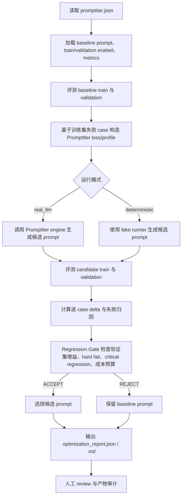

# PromptIter 评测回归闭环示例

这个示例实现一个完整的 Evaluation + PromptIter + Regression Gate 闭环：先评测 baseline prompt，再基于失败样本生成候选 prompt，随后重新跑验证集，最后通过 gate 判断候选是否值得接受，并输出 JSON 与 Markdown 审计报告。

示例支持两种运行模式：

- `real_llm`：使用真实 OpenAI-compatible LLM，调用 `evaluation/workflow/promptiter/engine`、candidate agent、judge agent、backwarder、aggregator、optimizer。
- `deterministic`：使用 fake model / trace mode / deterministic runner 风格的本地逻辑，不需要真实 API Key，主要用于单元测试、CI 和无网络环境验证闭环。

报告中的 `mode` 和 `data_source` 字段会明确说明本次报告来自真实 LLM 还是 deterministic fake path。

## 工作流程



## 运行真实 LLM 模式

```bash
cd examples/evaluation

# DeepSeek API Key。也兼容 DEEPSEEK_API_KEY / DEEPSEEK_API_KEY1 / OPENAI_API_KEY。
export LLM_API_KEY="your-api-key"

# 可选：自定义 OpenAI-compatible endpoint。
# DeepSeek 官方 OpenAI-compatible base_url 默认为 https://api.deepseek.com。
export LLM_BASE_URL="https://api.deepseek.com"

go run ./promptiter_regression_loop \
  -config ./promptiter_regression_loop/data/promptiter.json \
  -mode real_llm
```

真实 LLM 模式会读取 `data/promptiter.json` 中的模型配置：

```json
{
  "llm": {
    "candidate_model": "deepseek-chat",
    "judge_model": "deepseek-chat",
    "worker_model": "deepseek-chat"
  }
}
```

环境变量优先级如下：

- API Key：`LLM_API_KEY` -> `DEEPSEEK_API_KEY` -> `DEEPSEEK_API_KEY1` -> `OPENAI_API_KEY`
- Base URL：`LLM_BASE_URL` -> `DEEPSEEK_BASE_URL` -> `OPENAI_BASE_URL` -> `https://api.deepseek.com`
- Model override：可用 `LLM_MODEL` 临时覆盖 `promptiter.json` 中的模型名

## 运行 deterministic 兼容模式

```bash
cd examples/evaluation
go run ./promptiter_regression_loop \
  -config ./promptiter_regression_loop/data/promptiter.json \
  -mode deterministic
```

该模式不调用真实模型，会根据 case id 和 prompt marker 生成稳定输出，用于复现“训练集提升但验证集 critical case 退化，因此 gate 拒绝”的场景。

## 输出文件

运行后会生成：

- `output/real_llm_optimization_report.json` / `output/real_llm_optimization_report.md`：真实 LLM 模式报告。
- `output/deterministic_optimization_report.json` / `output/deterministic_optimization_report.md`：fake model / deterministic 模式报告。

报告文件名前缀与报告内的 `mode` 字段一致，便于同时保留和对比真实环境与 mock 环境结果。JSON 报告包含 baseline、candidate、delta、gate、失败归因、成本、耗时、PromptIter patch/profile/loss；Markdown 报告面向人工 review。

## 文件说明

### 入口与流程

- `main.go`：CLI 入口。读取 `-config` 和 `-mode`，根据模式选择真实 LLM pipeline 或 deterministic pipeline，并写出报告。
- `load.go`：读取 `promptiter.json`、baseline prompt、train/validation evalset、metrics，并把 critical case 配置合并进验证集。
- `pipeline.go`：deterministic 兼容模式的主流程。跑 baseline train/validation、生成候选、跑 candidate train/validation、计算 delta、执行 gate、组装报告。
- `real_pipeline.go`：真实 LLM 模式主流程。构建真实 PromptIter runtime，调用 `evaluation/workflow/promptiter/engine.Run` 生成候选 prompt，并重新跑带 run details 的 baseline/candidate 评测，确保报告中包含真实 final response 和工具调用证据。
- `real_agent.go`：真实 LLM 模式的 agent 和工具定义。创建 candidate agent、judge agent、PromptIter worker agents，并提供 `lookup_weather` 工具。
- `real_adapt.go`：真实 LLM 结果适配层。把 PromptIter/evaluation 的结果转换为本示例统一的 `EvaluationRun`、`CaseResult`、`DeltaSummary` 数据结构。
- `metric_registry.go`：示例级 metric 扩展注册。通过项目已有 `evaluation/metric/registry` 注册 `expected_json_exact_when_requested`，让 `structured_output_guard` 复用框架内置 `final_response_avg_score` evaluator，仅在参考答案为 JSON 时做精确 JSON 结构和值比较。

### 评测、归因与 gate

- `evaluator.go`：deterministic 本地 evaluator。模拟 final response、tool trajectory、JSON format/rubric 评分，并生成 trace/tool trajectory 摘要。
- `attribution.go`：失败归因。根据 metric name、reason、trace/tool signal 分类为 final response mismatch、tool call error、tool argument error、route error、format error、knowledge recall gap 等。
- `delta.go`：逐 case 回归对比。识别 `fixed`、`regressed`、`stayed_pass`、`stayed_fail`，并统计新增通过、新增失败、分数提升、分数下降、critical regression。
- `gate.go`：接受策略。检查验证集分数提升阈值、新增 hard fail、critical case 退化、调用次数和成本预算。
- `optimizer.go`：PromptIter 风格产物生成。deterministic 模式下把候选 prompt 转成 `CaseLoss`、`PatchSet`、`Profile`，让报告结构和 PromptIter 对齐。

### 报告与类型

- `types.go`：所有配置、评测结果、delta、gate、报告结构定义。
- `report.go`：按运行模式前缀写出 `*_optimization_report.json` 和 `*_optimization_report.md`，并在 Markdown 中展示运行模式、数据来源、分数、gate 理由、逐 case delta 和验证集输出证据。

### 测试

- `gate_test.go`：覆盖 gate 决策、逐 case delta、失败归因和 Markdown 报告生成。
- `pipeline_test.go`：覆盖 deterministic 端到端流程，验证训练集提升但验证集 critical case 退化时会被拒绝。

### 数据文件

- `data/promptiter.json`：pipeline 配置。包含 mode、prompt 路径、train/validation evalset、metrics、真实 LLM 模型、fake engine 信息、gate 策略和 deterministic candidate。
- `data/train.evalset.json`：训练评测集，包含 3 条 case，用于发现 baseline prompt 的失败。
- `data/validation.evalset.json`：验证评测集，包含 3 条 case，其中 `val_critical_direct_status` 是关键 case，用于检测过拟合退化。
- `data/metrics.json`：评测指标。真实 LLM 模式使用内置 `final_response_avg_score`、`tool_trajectory_avg_score` 和 `llm_rubric_critic`；其中 `structured_output_guard` 通过 `compareName` 接入示例注册的 JSON 精确比较函数。deterministic 模式按相同 metric name 做本地模拟评分。
- `data/prompts/baseline_prompt.md`：baseline prompt 源文件。
- `output/*_optimization_report.json`：示例输出 JSON 报告，文件名前缀区分运行模式。
- `output/*_optimization_report.md`：示例输出 Markdown 报告，文件名前缀区分运行模式。

## 方案设计说明

该示例把 Evaluation Service、PromptIter 和外层 Regression Gate 串成一条可审计闭环。真实 LLM 模式不绕开框架能力：先用 `evaluation.New` 连接 evalset manager、metric manager、evalresult manager、metric registry、candidate runner 和 judge runner，再把该 evaluator 注入 `evaluation/workflow/promptiter/engine`，由 engine 完成 baseline validation、train loss 抽取、backward、aggregation、optimizer、candidate validation 和内层 min score gain acceptance。示例层只补充业务发布所需的失败归因、逐 case delta、hard fail / critical regression / budget gate 和审计报告。失败归因结合 final response、tool trajectory、trace、rubric 和结构化输出信号，将问题归为 final response mismatch、tool call error、tool argument error、route error、format error、knowledge recall gap 等类别；结构化输出通过 `final_response_avg_score` 和命名 compare 复用框架 metric registry，仅在参考答案是 JSON 时校验字段和值，避免误伤自然语言 case。候选 prompt 必须重新跑完整验证集，并与 baseline 对比 fixed、regressed、stayed_pass、stayed_fail、新增 hard fail、分数升降和 critical regression。接受策略要求验证集总分提升达到阈值，不能新增 hard fail，关键 case 不能退化，同时校验调用次数和成本预算；因此即使总分提升，只要关键验证 case 退化也会被拒绝。最终报告保存每轮 prompt/profile/patch/loss、eval result、delta、gate 理由、随机种子、模型或 fake engine 配置、成本和耗时，供自动化系统与人工 reviewer 审计。

## 交付物核对

- Go pipeline 入口：`main.go` 提供 `-config` 和 `-mode` CLI，`pipeline_test.go` 覆盖 deterministic 可运行链路。
- 样例输入：`data/train.evalset.json`、`data/validation.evalset.json`、`data/metrics.json`、`data/prompts/baseline_prompt.md`、`data/promptiter.json` 和本 README。
- 评测 case：共 6 条，训练 3 条、验证 3 条；覆盖 `val_json_refund` 可优化成功、`val_weather_berlin` 优化无效保持通过、`val_critical_direct_status` 在 deterministic 候选中优化后退化。
- 示例输出：`output/deterministic_optimization_report.json`、`output/deterministic_optimization_report.md`、`output/real_llm_optimization_report.json`、`output/real_llm_optimization_report.md`。
- 中文翻译：英文流程/报告对应 `operation_flow_and_conclusion.zh.md`、`deterministic_optimization_report.zh.md`、`real_llm_optimization_report.zh.md`。
- 单元测试：`gate_test.go` 覆盖 gate 决策、逐 case delta、失败归因、报告生成和候选选择；`pipeline_test.go` 覆盖端到端拒绝过拟合候选。

## 测试

```bash
cd examples/evaluation
go test ./promptiter_regression_loop
```
