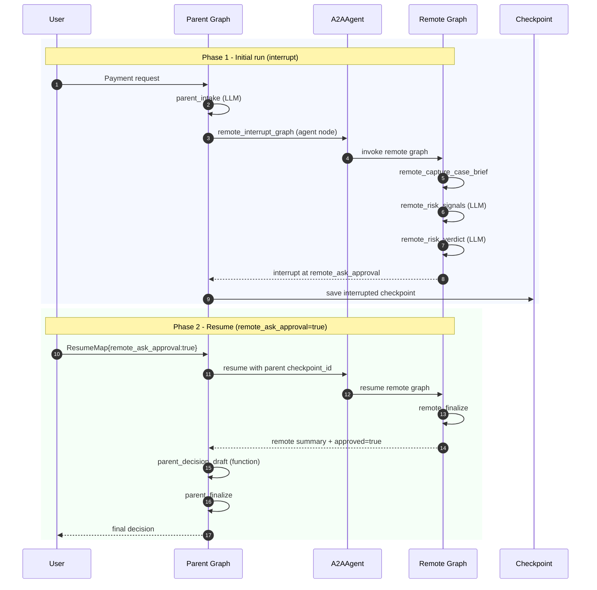

# Graph A2A Interrupt Example

This example demonstrates interrupt/resume across a parent graph and a remote
graph connected through A2A.

## What it shows

1. A parent `GraphAgent` calls a remote `GraphAgent` using an `A2AAgent`.
2. The remote graph interrupts at `graph.Interrupt(...)`.
3. Interrupt metadata (lineage, checkpoint, namespace) travels back through A2A
   inside the existing `state_delta` envelope (`_pregel_metadata`).
4. The parent graph run stops and stores subgraph interrupt metadata.
5. The parent graph resumes with `ResumeMap`.
6. Resume metadata is sent back through A2A to the remote graph.
7. The remote graph continues from the original checkpoint and finishes.

## Flow



## How interrupt metadata travels

Interrupt information is carried inside the existing `state_delta` metadata
channel. No separate `graph_control` key is needed.

**Downstream (interrupt, Server → Client):**

```
Graph Engine → event.StateDelta[_pregel_metadata]
  → Server EncodeStateDeltaMetadata → A2A Message metadata["state_delta"]
  → A2A Agent DecodeStateDeltaMetadata → event.StateDelta[_pregel_metadata]
  → Parent graph extracts lineage/checkpoint/namespace
```

**Upstream (resume, Client → Server):**

```
Parent graph RuntimeState[lineage_id, checkpoint_id, ...]
  → A2A message.Metadata (flattened keys)
  → Server graphResumeStateFromMetadata → graph.ResumeCommand
  → Graph resumes from checkpoint
```

The server-side `GraphResumeStateFromMetadata` (in `internal/a2a`) supports
three fallback paths:

1. `state_delta` encoded resume fields (preferred)
2. `_pregel_metadata` inside `state_delta` (for interrupt events echoed back)
3. Flattened metadata keys (backward compatibility)

## Flow Logic

1. Parent graph starts with user input and runs `parent_intake` to build a case brief.
2. Parent calls remote graph through `A2AAgent` (`remote_interrupt_graph`).
3. Parent uses `WithSubgraphInputFromLastResponse()` so the remote invocation
   input is the latest case brief, not an empty `user_input`.
4. Remote graph captures and stores case brief at `remote_capture_case_brief`.
5. Remote graph produces risk signals and verdict, then pauses at
   `remote_ask_approval` via `graph.Interrupt(...)`.
6. Interrupt metadata is propagated back to parent via `state_delta._pregel_metadata`,
   and parent checkpoint is marked interrupted.
7. Parent resumes with:
   - `checkpoint_id`: interrupted parent checkpoint to continue from
   - `StateKeyCommand.ResumeMap["remote_ask_approval"]=true`: answer for remote interrupt key
8. Resume request is forwarded through A2A, remote graph continues from its checkpoint and finishes.
9. Remote final state is mapped into parent state by `WithSubgraphOutputMapper`.
10. Parent runs `parent_decision_draft` and `parent_finalize`, then returns final decision.

## State and Field Passing

| Stage | Key | Meaning | Where it goes |
|---|---|---|---|
| Parent runtime state | `lineage_id` (`graph.CfgKeyLineageID`) | Execution lineage identifier | Used by checkpoint manager to locate run history |
| Parent runtime state | `checkpoint_ns` (`graph.CfgKeyCheckpointNS`) | Parent checkpoint namespace | Combined with lineage to isolate this run |
| Remote interrupt | `remote_ask_approval` (interrupt key) | Manual approval prompt key (use node ID as key) | Stored as pending interrupt value until resume |
| A2A transport | `state_delta._pregel_metadata` | Interrupt metadata (lineage, checkpoint, namespace, interrupt key/value) | Carried in A2A message metadata envelope |
| Parent checkpoint | `graph.StateKeySubgraphInterrupt` | Subgraph interrupt metadata | Persisted in parent interrupted checkpoint |
| Parent resume state | `checkpoint_id` (`graph.CfgKeyCheckpointID`) | Resume from this parent checkpoint | Tells graph where to continue |
| Parent resume state | `graph.StateKeyCommand.ResumeMap["remote_ask_approval"]` | Resume answer for remote interrupt | Propagated to remote interrupt continuation |
| Remote final state | `remote_approved` | Approval result from interrupt resume | Mapped to parent `approved_from_remote` |
| Remote final state | `remote_summary` | Remote risk review summary | Mapped to parent `remote_summary` |
| Parent final state | `parent_final_message` | Final business decision text | Returned in completion `state_delta` |

Field mapping in parent output mapper:

- `remote_approved` -> `approved_from_remote`
- `remote_summary` -> `remote_summary`

## A2A Server Configuration

The server must allowlist interrupt-related graph event types:

```go
a2aserver.WithGraphEventObjectAllowlist(
    graph.ObjectTypeGraphExecution,
    graph.ObjectTypeGraphNodeCustom,
    graph.ObjectTypeGraphPregelStep,
    graph.ObjectTypeGraphCheckpointInterrupt,
)
```

Without this, interrupt events are filtered out and the client cannot detect
that the graph has paused.

## Demo simplification

For deterministic example output, risk assessment is intentionally fixed to a
high-risk result in code (`HIGH` with predefined signals/reason). The goal is
to keep focus on interrupt/resume mechanics instead of model variance.

## Run

Before running, export model credentials/environment:

```bash
export OPENAI_API_KEY="<YOUR_API_KEY>"
export OPENAI_BASE_URL="<YOUR_OPENAI_COMPATIBLE_BASE_URL>"
# Optional: set default model for this example
export MODEL_NAME="gpt-5"
```

If these variables are empty, model calls will fail.

```bash
cd examples/graph
go run ./a2a_interrupt
```

Optional flags:

```bash
go run ./a2a_interrupt -streaming=false
go run ./a2a_interrupt -host 127.0.0.1:28883
go run ./a2a_interrupt -timeout=60s
go run ./a2a_interrupt -model gpt-5
```

## Example output (trimmed)

```text
Phase 1 Result
  Status            : Parent graph stopped because remote graph raised an interrupt
  Parent checkpoint : <checkpoint-id>
  Remote checkpoint : <checkpoint-id>
  Interrupt key     : remote_ask_approval
  Resume payload    : ResumeMap{remote_ask_approval: true}

Phase 1 Walkthrough
  [03] Remote / Risk signals
       Signals: large amount; new beneficiary; high-risk region; urgent timeline
  [05] Remote / Risk verdict
       RISK_LEVEL=HIGH; REASON=Large amount, beneficiary novelty, geography risk, and urgency together require manual approval.

Phase 2 Result
Final decision
Case: Case brief: ...
Remote review: risk=HIGH; signals=large amount, new beneficiary, high-risk region, urgent timeline; reason=...; manual_approved=true
Action: Decision draft: Manual approval granted after remote risk review, transfer can proceed with audit logging and post-transfer monitoring.
```

## Notes

- The in-process A2A server allowlist includes:
  - `graph.execution`
  - `graph.node.custom`
  - `graph.pregel.step`
  - `graph.checkpoint.interrupt`
- This example uses a real OpenAI-compatible model instance.
- Provide model and credentials via environment variables:
  - `OPENAI_API_KEY` (required)
  - `OPENAI_BASE_URL` (required)
  - `MODEL_NAME` (optional, can be overridden by `-model`)
