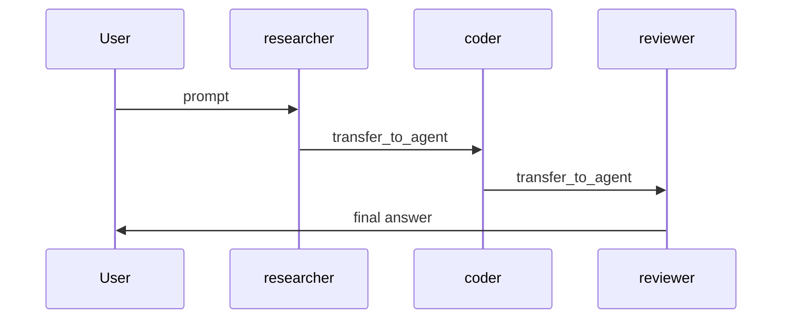

# Team Example

This example demonstrates the top-level `team` package.

It supports two modes:

- `team`: a coordinator agent calls member agents as tools and then replies.
- `swarm`: member agents hand off to each other via `transfer_to_agent`.

## What is a Team?

A Team is an `agent.Agent` that helps you run multiple Agents together.

- In `team` mode, the coordinator is in charge and can call members as tools.
- In `swarm` mode, there is no coordinator loop; the current member can decide
  to hand off to another member.

## Prerequisites

- Go 1.21 or later
- A valid OpenAI-compatible Application Programming Interface (API) key

## Terminology

- Application Programming Interface (API): the interface your code calls to
  talk to a model service.
- Uniform Resource Locator (URL): a web address, like `https://...`.

## Environment Variables

| Variable          | Description                              | Default Value               |
| ----------------- | ---------------------------------------- | --------------------------- |
| `OPENAI_API_KEY`  | API key for the model service (required) | ``                          |
| `OPENAI_BASE_URL` | Base URL for the model API endpoint      | `https://api.openai.com/v1` |

## Command Line Arguments

| Argument      | Description                           | Default Value   |
| ------------- | ------------------------------------- | --------------- |
| `-mode`       | `team` or `swarm`                     | `team`          |
| `-model`      | Name of the model to use              | `deepseek-chat` |
| `-variant`    | Variant passed to the OpenAI provider | `openai`        |
| `-streaming`  | Enable streaming output               | `true`          |
| `-timeout`    | Request timeout                       | `5m`            |
| `-show-inner` | Show inner member transcript in `team` mode | `true`      |
| `-member-history` | Member history scope: `parent` or `isolated` | `parent` |
| `-member-skip-summarization` | Skip coordinator summary after member tool | `false` |
| `-parallel-tools` | Enable parallel tool execution | `false` |

## Usage

### Coordinator Team Mode

```bash
cd examples/team
export OPENAI_API_KEY="your-api-key"
go run . -mode team
```

Notes:

- If the output shows a line like `[tools] ...`, the coordinator is calling a
  member as a tool.
- By default, member tool output is streamed in `team` mode. Pass
  `-show-inner=false` to hide it (you will only see `[tool.done] ...`).
- Use `-member-history=parent` (default) when members should see the
  coordinator's conversation history. Use `-member-history=isolated` when you
  want members to only see the tool input and their own outputs.
- `-member-skip-summarization=true` is an advanced mode: the coordinator will
  end the run right after member tools return, so the user sees member tool
  outputs directly (no coordinator synthesis).
- `-parallel-tools=true` allows multiple member tool calls in the same model
  turn to run concurrently. For this to happen, the coordinator must emit
  multiple tool calls in one response.
- For very long prompts, increase `-timeout` (for example, `-timeout 10m`).

### Swarm Mode

```bash
cd examples/team
export OPENAI_API_KEY="your-api-key"
go run . -mode swarm
```

## How It Works

### Team Mode (Coordinator calls members as tools)

```mermaid
flowchart LR
    U[User] --> T[team (coordinator)]
    T -->|tool call| C[coder]
    T -->|tool call| R[researcher]
    T -->|tool call| V[reviewer]
    T --> U
```

### Swarm Mode (Members hand off)


