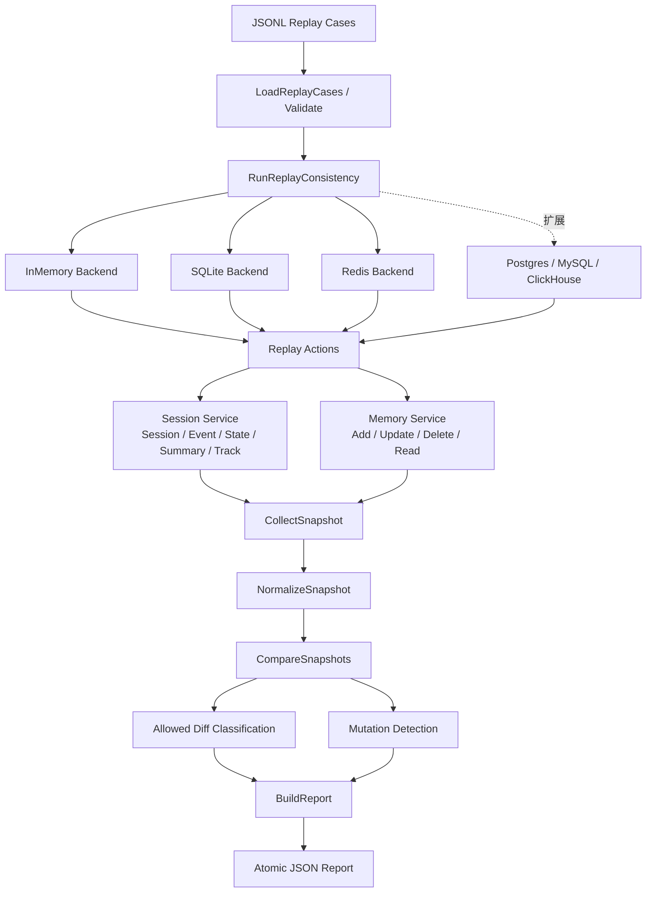

# Session / Memory / Summary Replay Consistency Harness

用于验证 tRPC-Agent-Go 中 Session、Memory、Summary 与 Track 数据在不同存储后端上的持久化语义是否一致。

该测试框架读取一组后端无关的 JSONL replay case，依次执行多轮对话、工具事件、State 更新、Memory 增删改、Summary 生成及 Track 写入等操作；随后通过公共 Service API 从各后端重新读取数据，生成统一快照，经过归一化后进行字段级比较，并输出可审计的 JSON 差异报告。

> 当前代码已接入 `InMemory`、`SQLite` 和 `Redis`。未配置真实 Redis 地址时，Redis 后端自动使用 `miniredis`，因此默认测试不依赖外部服务。`Postgres`、`MySQL` 和 `ClickHouse` 的环境变量约定与接入流程在本文后半部分给出；在对应 `BackendFactory` 注册到代码前，这三个名称不能直接写入 `REPLAY_BACKENDS`。

## 目录

- [目标与验证范围](#目标与验证范围)
- [系统架构](#系统架构)
- [完整数据流程](#完整数据流程)
- [核心数据模型](#核心数据模型)
- [代码结构](#代码结构)
- [Replay Case 格式](#replay-case-格式)
- [运行说明](#运行说明)
- [后端选择与环境变量](#后端选择与环境变量)
- [轻量模式](#轻量模式)
- [Redis 集成模式](#redis-集成模式)
- [PostgresMySQLClickHouse 集成模式](#postgresmysqlclickhouse-集成模式)
- [新增后端接入说明](#新增后端接入说明)
- [归一化与差异比较](#归一化与差异比较)
- [故障注入与 Mutation 检测](#故障注入与-mutation-检测)
- [报告说明](#报告说明)
- [已知限制](#已知限制)

## 目标与验证范围

Replay harness 主要回答以下问题：

1. 同一组业务操作写入不同后端后，重新读取的 Session、Event、State、Memory、Summary 和 Track 是否一致。
2. Event 与 Track 的写入顺序是否得到保留。
3. 工具调用、工具响应、`state_delta`、`filter_key` 等字段是否完整持久化。
4. Memory 的新增、更新、删除与后端生成 ID 是否能够稳定比较。
5. Summary 的内容、版本、修订号、更新时间、截断边界和 Session 归属是否正确。
6. Summary 与未压缩 Event tail 能否恢复出预期的模型上下文。
7. 对无法完全一致的字段，是否存在明确且可审计的归一化策略或 `allowed_diff` 解释。
8. 比较器能否识别重复 Event、脏 State、Summary 丢失或覆盖等人为故障。

该框架验证的是**存储与回放一致性**，不是 LLM 回答质量。测试使用确定性 Summarizer，避免模型生成随机性干扰后端比较。

## 系统架构



系统可以分为八层：

| 层次 | 职责 |
| --- | --- |
| Case 输入层 | 从 `testdata/replay_cases/*.jsonl` 加载后端无关的业务操作 |
| Runner 编排层 | 为每个 case 创建隔离后端并按顺序运行 |
| Backend 适配层 | 将统一动作映射到不同 Session/Memory Service |
| Replay 执行层 | 执行 Session、Event、State、Memory、Summary、Track 操作 |
| Snapshot 层 | 通过公共 API 重新读取真实持久化结果 |
| Normalize 层 | 消除已知的非业务表示差异 |
| Compare 层 | 递归生成字段级差异并应用 `allowed_diff` |
| Report 层 | 汇总运行、比较和 Mutation 检测结果，原子写出 JSON |

## 完整数据流程

### 1. 加载 Case

`LoadReplayCases` 按文件名字典序加载 `*.jsonl`。每一行对应一个 `ReplayAction`：

```text
metadata / allow_diff
create_session
append_event / append_track
update_state
add_memory / update_memory / delete_memory
create_summary / enqueue_summary
assert_session
checkpoint
```

`metadata` 和 `allow_diff` 用于描述 case，不作为业务写操作执行。其他动作会在每个目标后端上按原始顺序重放。

### 2. 重基准时间戳

Fixture 时间戳主要表达事件顺序，而不是测试运行时的真实墙钟时间。Runner 会整体平移 Event 和 Track 时间：

```text
原相对顺序保持不变
最早事件时间移动到 Session 创建时间之后
```

这样可避免持久化 Summary 后端拒绝早于 Session `CreatedAt` 的截断时间，同时保留事件间隔和先后关系。

### 3. 创建隔离后端

每个 case、每个后端使用独立临时目录或 key prefix：

```text
<temp-dir>/
└── <case-id>/
    ├── inmemory/
    ├── sqlite/
    └── redis/
```

SQLite 分别创建 Session DB 和 Memory DB；Redis 使用 `replay:<case-id>` 前缀，避免不同 case 相互污染。

### 4. 顺序执行 Replay Action

`Replay` 逐条调用 `executeReplayAction`，每个动作记录：

- action 下标；
- action 类型；
- 成功或失败；
- 执行耗时；
- 错误信息。

动作失败时会返回带 case、backend、action index 和 action type 的上下文错误。

### 5. 从后端重新读取

完成写入后，框架不会直接比较输入对象，而是调用：

```text
SessionService.GetSession
MemoryService.ReadMemories
```

将真实读回结果转换为存储无关的 `Snapshot`。这一步能够发现序列化、持久化、读取恢复和排序方面的问题。

### 6. 归一化

`NormalizeSnapshot` 只处理已知的非业务差异，例如：

- 后端名称；
- UTC 时间表示；
- JSON 对象字段顺序；
- `nil` 与空 map/slice；
- Memory 后端生成 ID；
- Topics、Participants、Track 名称等无序集合。

Event 和单个 Track 内部的事件顺序不会被重排，因为顺序本身就是需要验证的业务语义。

### 7. 跨后端比较

默认以第一个选中的后端为 reference，依次比较其他后端：

```text
reference vs backend-2
reference vs backend-3
...
```

比较器递归遍历 map、slice 和标量，输出精确 JSON Path，例如：

```text
$.sessions[0].events[2].content
$.sessions[0].state.task_status
$.sessions[0].summaries.agent/tool.revision
$.memories[1].participants[0]
```

### 8. Mutation 自检

当 `RunMutations` 为 `true` 时，框架会复制 reference 快照并故意破坏一个业务字段，再确认比较器能够发现差异。

### 9. 生成报告

报告包含：

- 每个 action 的运行结果；
- 各后端最终快照；
- 跨后端字段级差异；
- `allowed_diff` 数量；
- Mutation 检测结果；
- 总体通过或失败状态。

报告先写入临时文件，再通过 rename 原子发布，避免产生不完整 JSON。

## 核心数据模型

### Session

Session 由以下三元组定位：

```go
session.Key{
    AppName:   appName,
    UserID:    userID,
    SessionID: sessionID,
}
```

一个 Session 内包含：

```text
Session
├── State
├── Events
├── Summaries[filterKey]
└── Tracks[trackName]
```

### Event

当前快照比较以下 Event 字段：

- `id`、`index`；
- `invocation_id`、`author`；
- `role`、`content`；
- `tool_calls`；
- `tool_response_id`、`tool_name`；
- `state_delta`；
- `timestamp`；
- `filter_key`。

### Memory

Memory 以用户为作用域，不属于某个特定 Session：

```go
memory.UserKey{
    AppName: appName,
    UserID:  userID,
}
```

当前比较：

- ID；
- Content；
- Topics；
- Kind；
- EventTime；
- Participants；
- Location。

Fixture 中的 `ref` 是 case 内稳定引用。真实 Memory ID 由后端生成，Replay State 负责维护 `ref -> backend ID` 映射。

### Summary

Summary 保存在 Session 内：

```text
session.Summaries[filterKey]
```

当前比较：

- SessionID；
- FilterKey；
- Content；
- Topics；
- Revision；
- UpdatedAt；
- Boundary Version；
- CutoffAt；
- LastEventID。

`assert_session` 还可以验证 Summary 截断点后的 Event tail，并通过真实 `ContentRequestProcessor` 检查压缩后模型上下文。

### Track

Track 是 Session 内的命名观测流：

```text
Tracks[trackName] -> ordered TrackEvent list
```

当前快照包含 Track 名称、事件下标、Payload 和 Timestamp。工具耗时、子任务状态、Invocation 关联和错误信息可作为结构化 JSON 放入 Payload。

## 代码结构

| 文件 | 主要职责 |
| --- | --- |
| `runner.go` | Runner 配置、后端选择、case 编排、时间重基准、跨后端比较和 Mutation 触发 |
| `replay.go` | JSONL DSL、动作校验、Backend 接口、现有后端 Factory、动作执行、故障注入、断言、快照采集和确定性 Summary |
| `normalize.go` | 快照深拷贝、JSON/时间/空值/ID/集合顺序归一化 |
| `compare.go` | 递归字段比较、差异分类、上下文定位、`allowed_diff` 路径匹配 |
| `report.go` | Case/全局状态计算、统计指标、JSON 报告原子写入 |
| `testdata/replay_cases/*.jsonl` | 后端无关的 replay fixture |
| `*_test.go` | 调用 `RunReplayConsistency` 的测试入口 |

## Replay Case 格式

### 最小示例

```jsonl
{"action":"metadata","version":1,"id":"01_basic_dialog","description":"single-turn user and assistant events"}
{"action":"create_session","session_id":"session-001","state":{"status":"new"}}
{"action":"append_event","session_id":"session-001","event":{"id":"event-001","role":"user","content":"hello","timestamp":"2026-01-01T00:00:00Z"}}
{"action":"append_event","session_id":"session-001","event":{"id":"event-002","role":"assistant","content":"hi","timestamp":"2026-01-01T00:00:01Z"}}
{"action":"assert_session","session_id":"session-001","expected":{"event_ids":["event-001","event-002"],"unique_event_ids":true}}
{"action":"checkpoint","checkpoint":"after-dialog"}
```

> `state` 和 `state_delta` 的值类型是 `json.RawMessage`。在手写 JSONL 时，需要确保每个 value 本身也是合法 JSON。

### 支持的 Action

| Action | 作用 |
| --- | --- |
| `metadata` | 设置 schema 版本、case ID 和描述 |
| `allow_diff` | 声明某个后端允许出现的差异及原因 |
| `create_session` | 创建 Session，可附带初始 State |
| `append_event` | 追加用户、Assistant、工具调用或工具响应 Event |
| `append_track` | 向命名 Track 追加观测事件 |
| `update_state` | 更新 Session State |
| `add_memory` | 新增用户级 Memory |
| `update_memory` | 通过稳定 `ref` 更新 Memory |
| `delete_memory` | 通过稳定 `ref` 删除 Memory |
| `create_summary` | 同步生成 Session Summary |
| `enqueue_summary` | 提交异步 Summary 任务，可等待完成 |
| `assert_session` | 在单个后端内检查业务不变量 |
| `checkpoint` | 保存中间 Snapshot |

### Allowed Diff

```jsonl
{"action":"allow_diff","allowed_diff":{"path":"$.sessions[0].summaries.*.updated_at","backend":"postgres","reason":"backend timestamp precision is microseconds"}}
```

规则说明：

- `path` 支持精确 JSON Path；
- `*` 匹配一个字段或数组索引层级；
- `backend` 为空时适用于所有 actual backend；
- Allowed diff 仍会出现在报告中，但不会导致比较失败；
- `reason` 必须说明为什么该差异是合理的。

## 运行说明

### 前置条件

- 已安装项目 `go.mod` 所要求的 Go 版本；
- 在 tRPC-Agent-Go 仓库根目录执行命令；
- replay case 位于测试入口配置的目录，默认是 `testdata/replay_cases`；
- 外部集成模式需要对应服务可访问。

### 运行全部 replay consistency 测试

```bash
go test ./... -run '^TestReplayConsistency$' -count=1 -v
```

`-count=1` 用于关闭 Go test result cache，确保每次都真正执行后端读写。

### 指定报告路径

如果测试入口按照示例读取 `REPLAY_REPORT_PATH`：

```bash
mkdir -p ./artifacts
REPLAY_REPORT_PATH=./artifacts/session_memory_summary_track_diff_report.json \
  go test ./... -run '^TestReplayConsistency$' -count=1 -v
```

### 保留 SQLite 临时文件

默认情况下，未设置 `REPLAY_SQLITE_DIR` 时，Runner 会创建临时目录并在运行后删除。设置该变量可保留数据库文件以便排查：

```bash
mkdir -p /tmp/trpc-replay-sqlite
REPLAY_SQLITE_DIR=/tmp/trpc-replay-sqlite \
  go test ./... -run '^TestReplayConsistency$' -count=1 -v
```

### 只运行指定后端

```bash
REPLAY_BACKENDS=inmemory \
  go test ./... -run '^TestReplayConsistency$' -count=1 -v
```

```bash
REPLAY_BACKENDS=inmemory,sqlite \
  go test ./... -run '^TestReplayConsistency$' -count=1 -v
```

`REPLAY_BACKENDS` 是逗号分隔的 allowlist，名称不区分大小写，重复项会被去重。未知名称会直接返回错误。

## 后端选择与环境变量

### 当前代码已支持

| 变量 | 作用 | 默认行为 |
| --- | --- | --- |
| `REPLAY_BACKENDS` | 逗号分隔的后端 allowlist | `inmemory,sqlite,redis` |
| `REPLAY_REDIS_URL` | 真实 Redis 连接 URL | 未设置时使用 `miniredis` |
| `REPLAY_SQLITE_DIR` | SQLite 和临时后端工作目录根路径 | 未设置时使用系统临时目录并在结束后删除 |
| `REPLAY_SKIP_INMEMORY` | 跳过 InMemory | `false` |
| `REPLAY_SKIP_SQL` | 跳过 SQLite，兼容别名 | `false` |
| `REPLAY_SKIP_SQLITE` | 跳过 SQLite | `false` |
| `REPLAY_SKIP_REDIS` | 跳过 Redis | `false` |
| `REPLAY_REPORT_PATH` | JSON 报告路径，由测试入口读取 | 测试入口决定 |

Skip 变量通过 `strconv.ParseBool` 解析，因此可使用 `true`、`false`、`1`、`0` 等 Go 支持的布尔文本。

后端选择顺序决定 reference backend。例如：

```bash
REPLAY_BACKENDS=sqlite,inmemory,redis ...
```

此时 SQLite 是 reference，其他后端与 SQLite 比较。通常建议将 `inmemory` 放在第一位。

## 轻量模式

轻量模式不依赖真实 Redis、Postgres、MySQL 或 ClickHouse 服务，适合本地开发和普通 CI。

### 推荐模式：InMemory + SQLite

```bash
REPLAY_BACKENDS=inmemory,sqlite \
REPLAY_REPORT_PATH=./artifacts/replay-lightweight.json \
  go test ./... -run '^TestReplayConsistency$' -count=1 -v
```

该模式覆盖：

- 内存参考实现；
- SQLite 真实持久化；
- Session、Memory、Summary、Track 的主要序列化和读取恢复逻辑。

### 完整轻量矩阵：InMemory + SQLite + miniredis

```bash
unset REPLAY_REDIS_URL
REPLAY_BACKENDS=inmemory,sqlite,redis \
REPLAY_REPORT_PATH=./artifacts/replay-lightweight-full.json \
  go test ./... -run '^TestReplayConsistency$' -count=1 -v
```

Redis Factory 在 `REPLAY_REDIS_URL` 为空时自动启动 `miniredis`。这仍属于轻量模式，不会连接外部 Redis。

### 通过 Skip 变量运行

```bash
REPLAY_SKIP_REDIS=true \
  go test ./... -run '^TestReplayConsistency$' -count=1 -v
```

Skip 变量在 `REPLAY_BACKENDS` allowlist 之后应用。不要把所有选中的后端都跳过，否则 Runner 会报：

```text
replay backend selection is empty
```

## Redis 集成模式

Redis 是当前代码中已经实现的外部集成后端。

### 1. 启动 Redis

下面仅给出一个本地容器示例；也可以使用已有 Redis 服务：

```bash
docker run --rm -d \
  --name replay-redis \
  -p 6379:6379 \
  redis:7
```

### 2. 设置连接地址并运行

```bash
REPLAY_BACKENDS=inmemory,sqlite,redis \
REPLAY_REDIS_URL=redis://127.0.0.1:6379/0 \
REPLAY_REPORT_PATH=./artifacts/replay-redis-integration.json \
  go test ./... -run '^TestReplayConsistency$' -count=1 -v
```

带认证的示例：

```bash
REPLAY_REDIS_URL='redis://:password@127.0.0.1:6379/0' \
REPLAY_BACKENDS=inmemory,redis \
  go test ./... -run '^TestReplayConsistency$' -count=1 -v
```

每个 case 使用独立 key prefix：

```text
replay:<case-id>
```

集成环境应使用独立测试实例或专用 DB，避免与业务数据混用。


## 新增后端接入说明

### 1. 实现 BackendFactory

每个后端必须实现：

```go
type Backend interface {
    Name() string
    SessionService() session.Service
    MemoryService() memory.Service
    Close() error
}

type BackendFactory interface {
    Name() string
    Create(context.Context, BackendConfig) (Backend, error)
}
```

Factory 的职责是：

1. 为一个 case 创建隔离的 Session Service；
2. 创建对应 Memory Service；
3. 注入确定性 Summarizer；
4. 关闭连接池、后台任务和临时资源；
5. 使用 case ID、用户 ID、临时目录或 key prefix 避免 case 间污染。

### 2. 扩展配置

当前 `RunnerConfig` 和 `BackendConfig` 只显式包含 Redis URL。接入三个数据库时，可扩展为：

```go
type RunnerConfig struct {
    // existing fields...
    RedisURL     string
    PostgresDSN  string
    MySQLDSN     string
    ClickHouseDSN string
}

type BackendConfig struct {
    CaseID    string
    AppName   string
    UserID    string
    TempDir   string
    RedisURL  string
    PostgresDSN string
    MySQLDSN    string
    ClickHouseDSN string
    KeyPrefix string
}
```

也可以设计为通用 map，但显式字段更容易校验和定位配置错误。

### 3. 注册 Factory

在 `BackendFactoriesFromEnv` 中注册：

```go
available := map[string]BackendFactory{
    "inmemory":  InMemoryBackendFactory{},
    "sqlite":    SQLiteBackendFactory{},
    "redis":     RedisBackendFactory{},
    "postgres":  PostgresBackendFactory{},
    "mysql":     MySQLBackendFactory{},
    "clickhouse": ClickHouseBackendFactory{},
}
```

并读取连接变量：

```go
cfg.PostgresDSN = os.Getenv("REPLAY_POSTGRES_DSN")
cfg.MySQLDSN = os.Getenv("REPLAY_MYSQL_DSN")
cfg.ClickHouseDSN = os.Getenv("REPLAY_CLICKHOUSE_DSN")
```

添加对应 Skip 变量：

```go
{backend: "postgres", envs: []string{"REPLAY_SKIP_POSTGRES"}},
{backend: "mysql", envs: []string{"REPLAY_SKIP_MYSQL"}},
{backend: "clickhouse", envs: []string{"REPLAY_SKIP_CLICKHOUSE"}},
```

### 4. 保证隔离与清理

关系型数据库后端至少应满足一种隔离方式：

- 每个 case 独立 schema；
- 每个 case 使用唯一表前缀；
- 每个 case 使用唯一 AppName/UserID/SessionID；
- 运行前后执行可靠清理。

ClickHouse 等后端可能存在异步写入或最终一致性，Factory 或 Snapshot 收集层需要提供明确的 flush/await 机制，不能简单通过固定 `sleep` 假设写入已经可见。

### 5. 注入同一 Summarizer

所有 Session 后端必须使用相同的确定性 Summarizer，否则 Summary 文本差异将混入存储一致性测试。

```go
WithSummarizer(deterministicSummarizer{})
```

还应保持相同 Summary filter allowlist，例如：

```go
WithSummaryFilterAllowlist("agent/tool")
```

### 6. 使用公共 API 读取

新增后端不能直接查询私有表并组装期望结果。必须通过：

```text
SessionService.GetSession
MemoryService.ReadMemories
```

重新读取，以覆盖真实的反序列化和恢复路径。

### 7. 处理能力差异

当前 `Backend` 接口要求同时提供 Session Service 和 Memory Service；`append_track` 在后端不实现 `session.TrackService` 时会直接报错。

如果目标后端只支持 Session、Memory 或 Track 的一部分，建议后续引入显式能力描述：

```go
type BackendCapabilities struct {
    Session bool
    Memory  bool
    Summary bool
    Track   bool
}
```

报告可将缺失能力标记为 `unsupported`，并由 case 或 `allowed_diff` 决定是否接受，而不是直接中断整个矩阵。

### 8. 为新后端增加测试

至少补充：

- Factory 创建和配置错误测试；
- 数据库不可达测试；
- Session/Event/State 基础回放；
- Memory 增删改；
- Summary 创建与更新；
- Track 支持或 unsupported 行为；
- 时间精度、空值和 JSON 序列化差异；
- 清理与 case 隔离；
- 真实集成测试。

## 归一化与差异比较

### 当前归一化策略

`NormalizeOptions`：

```go
NormalizeOptions{
    NormalizeGeneratedMemoryIDs: true,
    NilEqualsEmpty:              true,
}
```

具体行为：

| 字段 | 归一化方式 |
| --- | --- |
| Backend 名称 | 清空，不作为业务值比较 |
| JSON RawMessage | 解析并重新编码，消除字段顺序和空白差异 |
| 时间 | 转为 UTC |
| nil map/slice | 根据配置转换为空 map/slice |
| Memory ID | 按规范化顺序重写为 `memory-001` 等 |
| Memory Topics/Participants | 排序 |
| Summary Topics | 排序 |
| Track 列表 | 按 Track 名称排序 |
| Event 顺序 | 不重排 |
| Track 内事件顺序 | 不重排 |

### Compare 行为

比较结果中的差异分为：

```text
session
state
event
memory
summary
track
serialization
```

只有未被 `allowed_diff` 覆盖的差异才会导致 `ComparisonResult.Equal == false`。

### 接入数据库后可能需要补充的归一化

Postgres、MySQL 和 ClickHouse 接入后，常见的合理差异可能包括：

- 时间戳精度不同；
- 浮点字段的存储精度；
- JSON number 的解码类型；
- 数据库返回的空数组与 NULL；
- 无业务语义的自动生成 ID；
- 异步写入耗时字段。

新增规则应遵循：

1. 只处理已知的非业务差异；
2. 不改变 Event 或 Track 内部顺序；
3. 不删除 Summary 边界、State 值等核心业务字段；
4. 优先使用明确的 NormalizeOption；
5. 无法统一表示时使用带原因的 `allowed_diff`。

## 故障注入与 Mutation 检测

Replay action 支持：

| 字段 | 含义 |
| --- | --- |
| `fail_before` | 写入前失败 |
| `fail_after` | 写入成功后向调用方返回失败 |
| `duplicate` | 重复执行同一写操作 |
| `retry` | 在失败场景中执行确认或重试 |

当前 Mutation 包括：

- Summary missing；
- Summary overwrite；
- Summary wrong session；
- Event duplicate；
- State dirty；
- Track payload corruption；
- 通用 Event/Memory/Summary 字段篡改。

Mutation 检测不是业务 case 本身，而是对比较器有效性的自检。任何 Mutation 未被发现，整个报告都会标记为失败。

## 报告说明

报告顶层结构：

```json
{
  "status": "passed",
  "generated_at": "...",
  "summary": {
    "case_count": 18,
    "backend_count": 3,
    "comparison_count": 36,
    "unexpected_diff_count": 0,
    "allowed_diff_count": 0,
    "mutation_count": 18,
    "detected_mutation_count": 18,
    "mutation_detection_rate": 1.0,
    "duration_ms": 1234
  },
  "cases": []
}
```

总体失败条件：

- 任一 Replay action 执行失败；
- 任一后端运行失败；
- 存在未允许的跨后端差异；
- 任一 Mutation 未被检测；
- 报告生成或写入失败。

命令行可使用 `FormatReportSummary` 输出紧凑摘要：

```text
status=passed cases=18 backends=3 unexpected_diffs=0 mutations=18/18 duration=1234ms
```

---

该 harness 的核心原则是：**同一业务操作、同一公共 API、同一确定性 Summary、统一快照、最小必要归一化、字段级可解释差异。**
