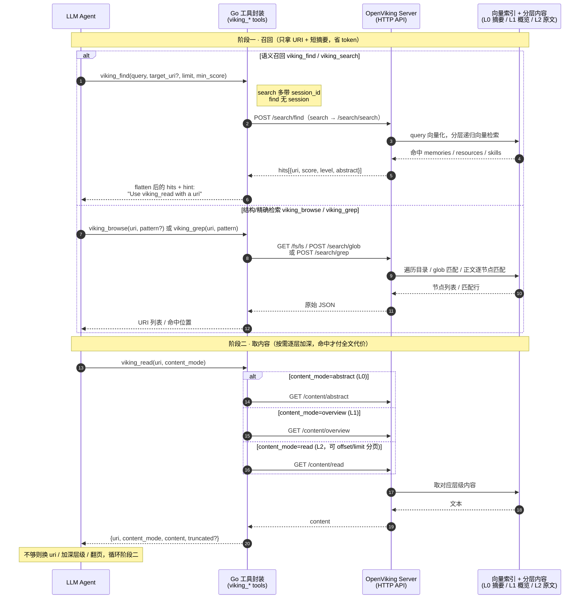
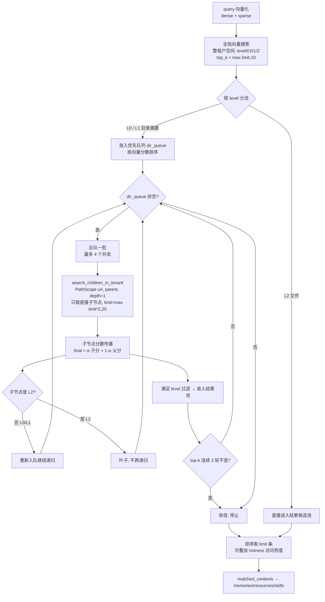

# OpenViking 检索流程说明

本文档说明 `tool/openviking` 暴露的几个检索类工具，从 Agent 调用到 OpenViking
服务端「分层递归 + 向量检索」的完整链路。分两部分：

1. 工具侧的两阶段「先搜后读」流程（泳道图）。
2. 服务端内部：搜索时**如何递归遍历节点**、**如何查询向量数据库**。

> 工具侧实现见 `tool/openviking/tools.go`、`tool/openviking/internal/client/client.go`。
> 服务端为 OpenViking（Python）实现，文中给出的文件/函数名用于追溯，非本仓库代码。

---

## 1. 工具分组

这套集成把检索拆成三组工具，全部围绕「先召回 URI + 摘要，再按需取全文」展开。

### 召回层（只返回 URI + 短摘要，不返回全文）

| 工具 | 后端接口 | 特点 |
|------|----------|------|
| `viking_find` | `POST /api/v1/search/find` | 纯语义召回，**无 session**，一次性查询 |
| `viking_search` | `POST /api/v1/search/search` | **带 `session_id`** 的上下文感知检索，多轮对话 |

两者都把后端的 `memories / resources / skills` 拍平为统一 `hits`，每条仅含
`uri / score / level / abstract`，并附 `hint` 引导模型下一步调 `viking_read`
（见 `tools.go` 的 `flatten`）。

### 结构 / 精确检索层

| 工具 | 后端接口 | 特点 |
|------|----------|------|
| `viking_browse` | `GET /api/v1/fs/ls` 或 `POST /api/v1/search/glob` | 列目录；给了 `pattern` 走 glob 文件名匹配 |
| `viking_grep` | `POST /api/v1/search/grep` | 在某个 URI 子树里做正文模式匹配（类 grep） |

### 取内容层

`viking_read(uri, content_mode)` 是唯一拿正文的入口，三档分层：

| `content_mode` | 层级 | 后端接口 |
|----------------|------|----------|
| `abstract` | L0 摘要 | `GET /api/v1/content/abstract` |
| `overview` | L1 概览 | `GET /api/v1/content/overview` |
| `read`（默认） | L2 全文 | `GET /api/v1/content/read`（支持 `offset/limit` 翻页、`max_chars` 截断） |

---

## 2. 两阶段检索泳道图（工具侧）

**设计核心：**

1. **召回只给摘要**：命中后只回 `uri + abstract`，不把全文塞进上下文，token 成本极低。
2. **按需加深**：模型先看 L0 判断相关性，有用再 `overview`(L1)，最后才 `read`(L2)
   拉全文——即 `flatten` 里 `"Use viking_read with a uri above to fetch full content."`
   强制引导的 **search then read** 模式。
3. **两条检索路径互补**：不知道在哪 → 语义 `find/search`；知道大致位置/想精确定位
   符号 → `browse/grep`。最终都汇聚到 `read` 逐层取内容。

---

## 3. 服务端：搜索时如何递归遍历节点

OpenViking 把内容存成 `viking://` 下的一棵树，每个节点带 `level` 字段：

- **L0**（`level=0`，abstract 摘要）：目录/文件的一句话摘要，URI 形如 `{dir}/.abstract.md`。
- **L1**（`level=1`，overview 概览）：更详细的概览，URI 形如 `{dir}/.overview.md`。
- **L2**（`level=2`，原文）：文件本身的完整内容，是树的**叶子**。

向量库里每条记录都带 `level` 和 `uri`，`uri` 是 `path` 类型，支持「父前缀 + 深度」过滤，
父子关系就靠 URI 前缀实现（如 `viking://resources/proj` 的直接子节点 URI 前缀为
`viking://resources/proj/...`）。

> 关键实现：`openviking/retrieve/hierarchical_retriever.py`（`HierarchicalRetriever`），
> 向量后端 `openviking/storage/viking_vector_index_backend.py`。

### 递归降序流程图

### 步骤拆解

1. **全局向量搜索**：先在整个租户空间做一次向量检索，`level∈{0,1,2}` 全参与，
   取 `max(limit, 10)` 条候选。
2. **起始点合并**（`_merge_starting_points`）：
   - **L0/L1（目录摘要）** → 作为递归起点放入优先队列 `dir_queue`（按相似度分数）。
   - **L2（文件）** → 作为初始结果候选直接进池。
   - 若干 `root_uris`（如 `viking://resources`、`{user}/memories`）也以 0.0 分入队兜底。
3. **优先队列广度优先展开**（`_recursive_search`）：每轮出队最多
   `MAX_PARALLEL_CHILD_SEARCHES=4` 个高分节点，**并发**调用
   `search_children_in_tenant`，用 `PathScope(uri, parent, depth=1)` 只取**直接子节点**
   （这是「递归」的本质：逐层下钻，而非一次性扫全子树）。
4. **分数沿树传播**：子节点最终分 = `alpha * 子节点向量分 + (1-alpha) * 父节点分`，
   高相关父目录下的子节点天然获得加成。
5. **终止规则**：子节点中 **L2 是叶子，不再入队**；L0/L1 继续入队递归。
6. **收敛停止**：top-k 的 URI 集合连续 `MAX_CONVERGENCE_ROUNDS=3` 轮不变即停。
7. **结果后处理**：按 `_final_score` 排序取 `limit` 条；可选叠加 hotness
   （`active_count` 访问次数 + `updated_at` 新鲜度）做最终重排，再按
   `context_type` 分拣成 `memories / resources / skills` 返回。

> 这套「目录摘要做路标、逐层下钻、分数传播 + 收敛」的设计，目的是在大规模语料里
> 既不漏掉相关文件，又不必把每个叶子文件都参与全量向量比对。

---

## 4. 服务端：如何查询向量数据库

### 4.1 查询向量化

`HierarchicalRetriever.retrieve()` 先把 query 转成向量（`embed_compat`，
`is_query=True`，先按 `max_input_tokens` 截断）：

- `dense_vector`：稠密向量（必有）。
- `sparse_vector`：稀疏向量（term→weight 字典，仅 hybrid 模式非空）。

embedder 由配置 `config.embedding.get_embedder()` 决定，支持 openai / volcengine /
vikingdb / local / jina / cohere / litellm / dashscope / voyage / minimax / gemini 等。
（本机部署里 embedding 走 Venus 的 `server:277357`。）

### 4.2 向量库技术栈

| 维度 | 说明 |
|------|------|
| 引擎 | OpenViking 自研 **C++ IndexEngine**（Python binding 暴露 `engine.IndexEngine`），**非** FAISS/ChromaDB/SQLite-vec |
| 索引模式 | `VolatileIndex`（纯内存）/ `PersistentIndex`（磁盘持久化） |
| 本地持久化 | 文件系统（`PersistCollection`，含 `collection_meta.json` 与 `index/` 目录） |
| 相似度度量 | 默认 **cosine**（`vectordb_config.py`：`distance_metric="cosine"`） |
| cosine 实现 | **L2 归一化向量 + 内积(IP)**：`cosine` 映射为底层 `ip` + `NormalizeVector=True` |
| 混合检索 | 支持 dense + sparse，`sparse_weight` 控制混合权重 |

### 4.3 检索参数

| 参数 | 取值 |
|------|------|
| 全局搜索 top_k | `max(limit, GLOBAL_SEARCH_TOPK=10)` |
| 子节点搜索 limit | `max(limit*2, 20)` |
| `score_threshold` | `passes_threshold(score)` 过滤；默认取自 rerank 配置（0 即关闭），可由调用方 `min_score` 覆盖 |
| 分数传播系数 | `alpha = score_propagation_alpha`（retrieval 配置） |
| 可选 rerank | 配置 rerank 且 `THINKING` 模式时，用 rerank 模型对 `abstract` 文本重打分替换向量分 |
| 可选 hotness | `hotness_alpha>0` 时，`final = (1-α)·语义分 + α·hotness` |

### 4.4 find 与 search 的区别

| 维度 | `/search/find` | `/search/search` |
|------|----------------|------------------|
| Session 感知 | 否 | 是（`session_id` 可选） |
| 查询扩展 | 单条 `TypedQuery` | 有 session 时由 LLM（`IntentAnalyzer`）结合 session 压缩摘要 + 近期消息，拆成多条 `TypedQuery` 并发执行 |
| 意图分析 | 无 | 有 |
| 结果合并 | 单个 `QueryResult` 分拣 | 多个 `QueryResult` 汇总分拣 |

两者底层都走 §3 的「分层递归 + 向量检索」，差别只在 search 会先用 session 上下文把
query 扩展/拆分成多条，再分别检索后合并。

---

## 5. 一句话总结

- **工具侧**：召回（find/search/browse/grep）只给 URI + 摘要 → 取内容（read）按
  L0→L1→L2 逐层加深。token 省在「先看摘要再决定读不读全文」。
- **递归**：以目录的 L0/L1 摘要节点为路标，优先队列按分数逐层下钻直接子节点
  （`depth=1`），L2 文件为叶子终止，分数沿树传播，top-k 收敛即停。
- **向量库**：自研 C++ IndexEngine，cosine（归一化 + 内积），dense(+sparse) 混合，
  全局 top_k=max(limit,10)、子层 max(limit*2,20)，可选 rerank / hotness 重排。
